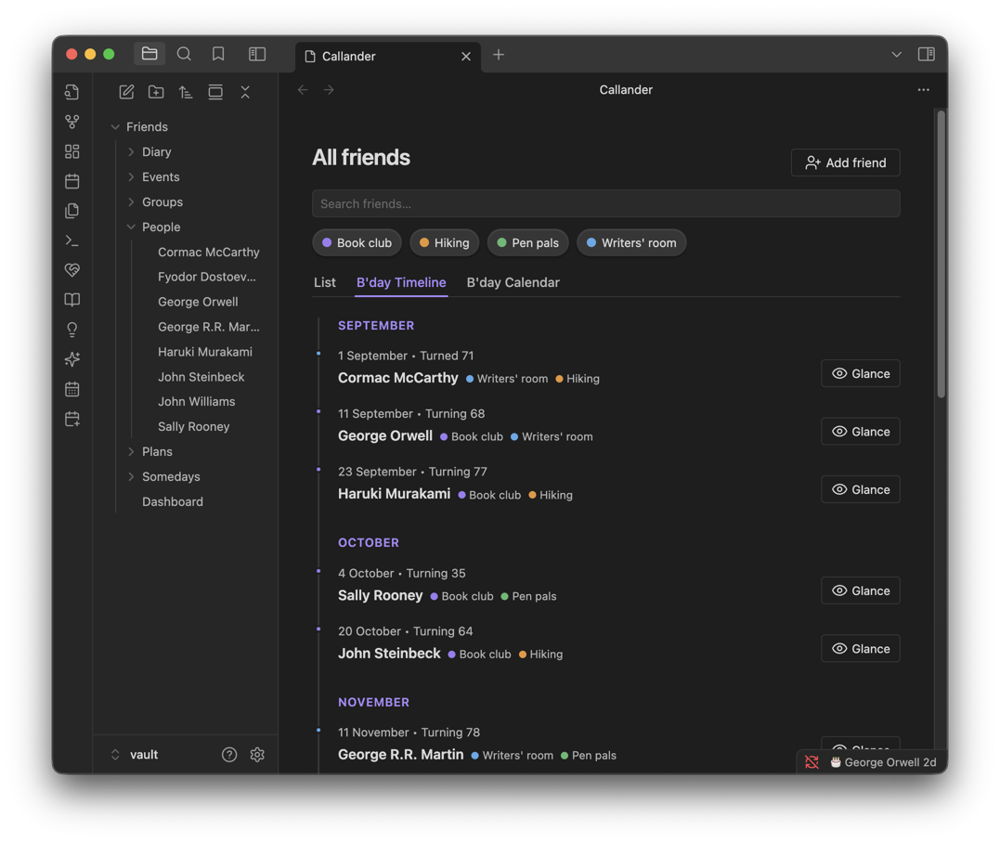
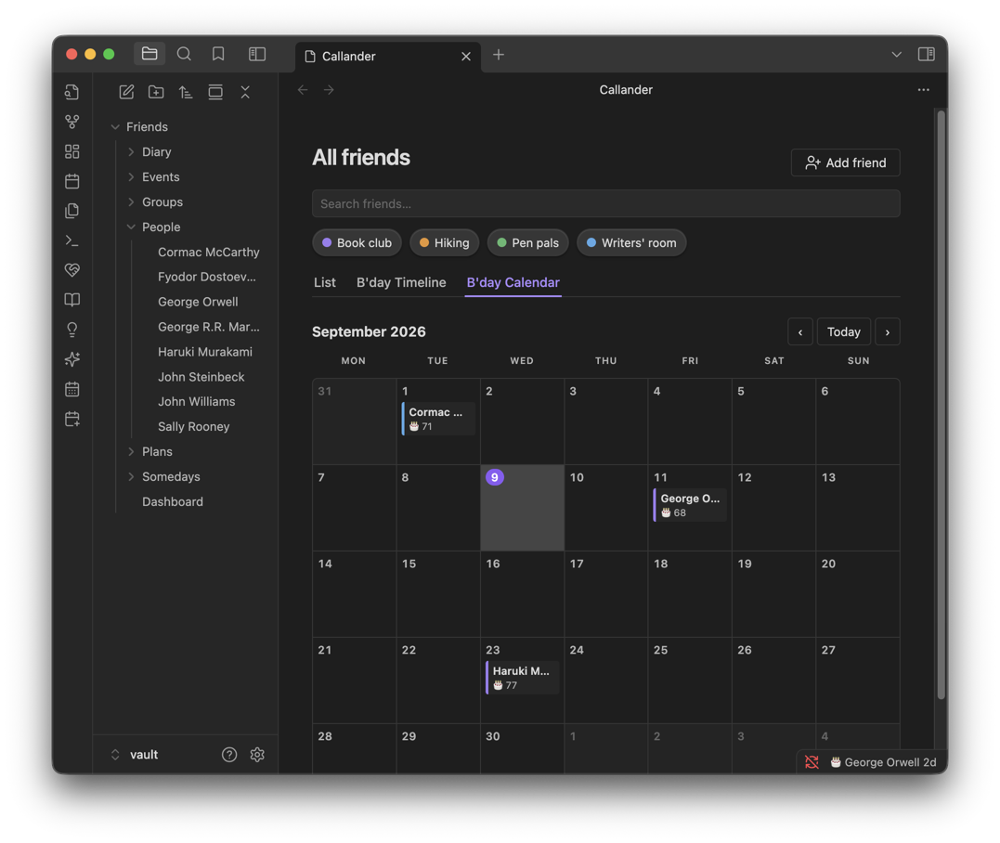
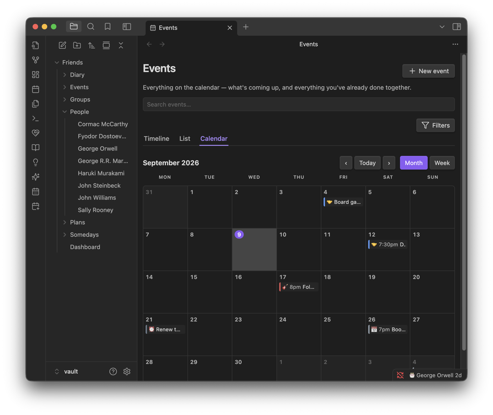
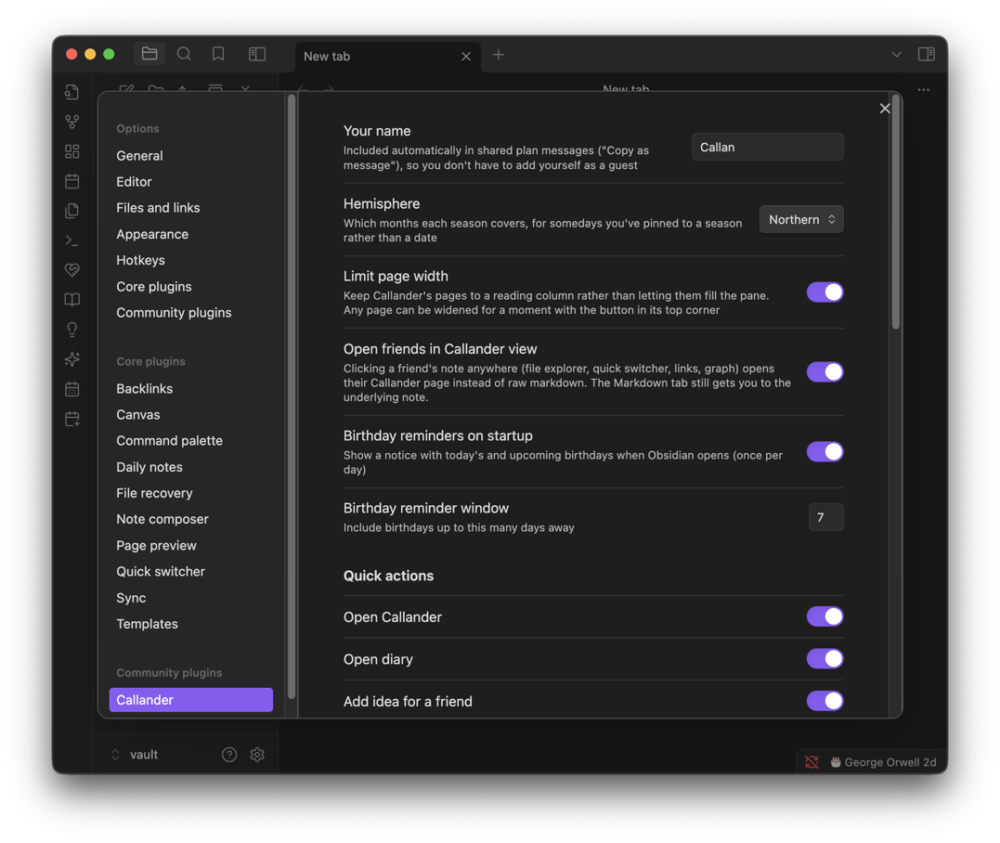
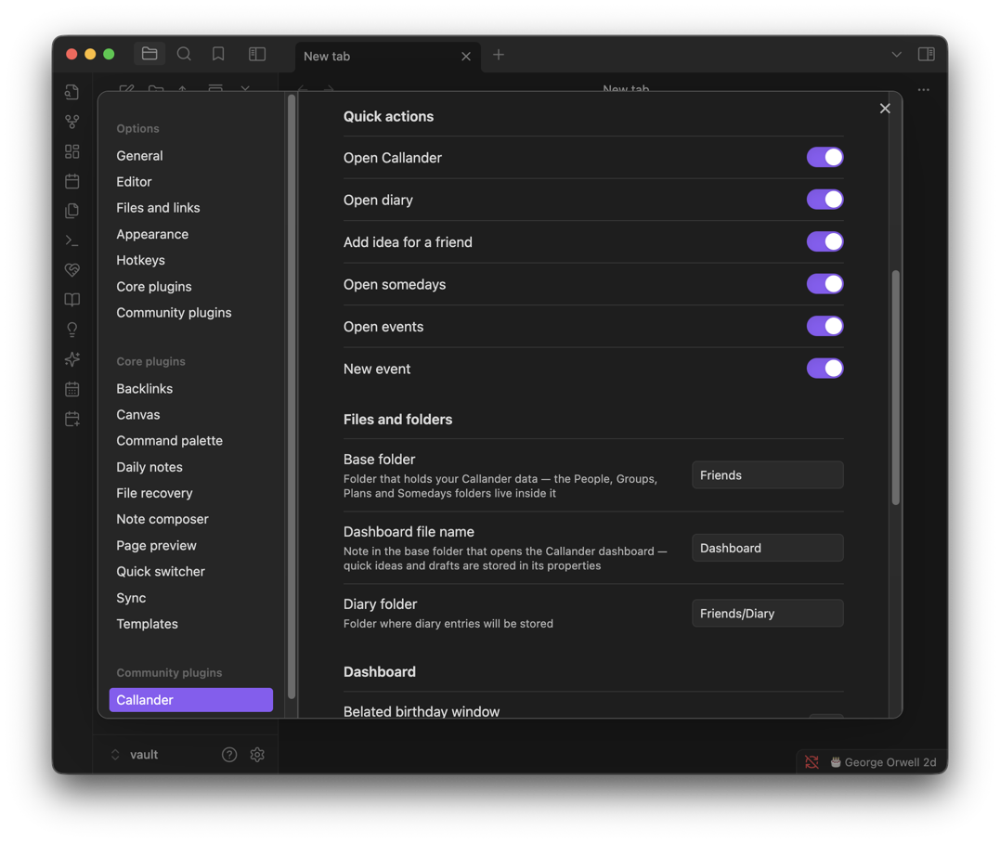

# Callander

**A private secondary memory for your friendships — living inside an Obsidian vault as plain Markdown.**

Callander remembers the things friendship runs on and your head doesn't hold: whose birthday is coming, what you meant to give them, where you got to in that conversation, who still owes what from the trip. Nothing leaves your vault, and everything you see below is stored as an ordinary note you can open and edit by hand.

Every screenshot here is a real capture of the plugin running against the example vault in `examples/example-vault`, which regenerates from scratch with `npm run seed`. The cast is eight authors standing in for your actual friends — the trivia about them is real, the birthdays and gift ideas are not, and the whole thing is set around Boston and northern New England.

Every page is kept to a comfortable reading width by default. When there's room beside it, a button in the top corner widens that one page for as long as you're on it, and the whole behaviour can be turned off in settings.

**Jump to:** [Dashboard](#dashboard) · [Friends](#friends) · [Groups](#groups) · [Quick notes](#quick-notes) · [Events](#events) · [Diary](#diary) · [Somedays](#somedays) · [Plans](#plans) · [Expenses](#expenses) · [Plugin settings](#plugin-settings) · [Suggesting a feature](#suggesting-a-feature)

---

## Dashboard

The dashboard is where you see everything at a glance — upcoming birthdays, the ones you missed, notes you've jotted down, what's coming up, your plans, your wishlist, recent diary entries, your groups, and any money still owed.

Four quick actions sit across the top to add a friend, jot an idea, take a quick note, and open your full list of friends. There's a search bar to find someone fast, with buttons below it for the friends you've looked at most recently. Each of those buttons shows a count of the ideas you've saved for that person, so you can see at a glance who you've got something ready for and who you haven't thought about in a while.

Underneath is anything you've jotted down and not yet filed. The idea is that writing something down should cost you nothing in the moment — you catch the thought, and decide later whether it was a gift idea, a conversation to have, or nothing at all.

Birthdays come next, counting down the next thirty days, and each one tells you whether you actually have a gift idea ready. Below them sit the birthdays you just missed. Those don't quietly disappear once the day has passed — they stay put, with a button to tick off, so the one you forgot stays in front of you until you've done something about it.

What's coming up sits under headings that say when rather than making you read a column of dates — This week, Next week, and anything with no exact date at all. It reaches a fortnight and no further; the rest lives on the Events page.

The rest of the page runs through the bigger trips you're planning, the loose wishlist of things you'd like to do one day, your last few diary entries, any one-off costs that still need settling, and your groups. Everything is read straight from your notes, so nothing on this page can go out of date.

On Obsidian 1.13 and later you can drag those sections into whatever order suits you, in the plugin's settings. If money owed is the thing you open the app for, put it at the top.

	
	 
	<em>Quick actions, friend search, and the notes waiting to be filed.</em>

	
	 
	<em>Birthdays with gift ideas flagged, missed ones held for you, and what's on the calendar.</em>

	
	 
	<em>Trips in the diary, and the wishlist of things without a date yet.</em>

	
	 
	<em>The tail of the page: recent entries, your groups, and money still to settle.</em>

---

## Friends

Each friend gets a page of their own, and it holds the things you'd want in front of you before you saw them.

At the top, Callander works out their exact age and how long until their next birthday, along with their star sign, birthstone and birth flower. Anything you jotted down about them and never filed sits just below, waiting to be sorted.

Then come your ideas for them, grouped by what they are — gifts, conversations you want to pick back up, things to do together, books to lend. You can set a date on any idea and it will come back to you on the dashboard when that day arrives, which is how "get him something for the garden" survives the eight months between thinking it and needing it.

Their timeline is one merged history of the two of you. Anything coming up sits at the top, including any trips they're part of, and below that it becomes a year-by-year record going back to the day you met — which is itself the first entry.

The rest of the page is the character stuff. Interests are short and factual — a hobby, a drink they always order, a team they follow — kept that way so they're actually useful when you're buying a present. Fun facts is the trivia drawer. Inside jokes keep the shared reference next to the story of how it started, which is the half you always forget. Quotes holds the lines worth keeping, and there's a free-text area at the bottom for anything that doesn't fit a box.

Your full list of friends lives on its own page, and it shows the same people three ways. **List** is the plain roll-call: narrow it to a single group, and sort by next birthday, where in the year a birthday falls, name, who you added most recently, who you saw last, or age. **B'day Timeline** is the year ahead, month by month, with the age each person is turning. **B'day Calendar** is that same year as a month grid, one square per day. Every row and every square opens a short briefing on that person for when you're about to see them.

A birthday you only know the month of still counts on both — it sits in the right month and says the day is unknown, rather than being hidden or given a date nobody wrote down. Anyone with no birthday at all is listed by name at the bottom of the timeline, because the fix is on their page and you can't do it if you can't see who they are.

Adding someone asks for very little — a first name is enough. Everything else is there for when you need it: what you actually call them, how their name should be shortened in lists, their pronouns as free text so whatever they use goes in as they write it, and a birthday you can give as a full date, a month and year, or just a day and month when nobody remembers the year. You can tick them into groups on the way in.

	
	 
	<em>Everyone in one list, filtered by group and sorted however you like.</em>

	
	 
	<em>The same people as a year of birthdays, with the age each one is turning.</em>

	
	 
	<em>And as a month grid, a square per day.</em>

	
	 
	<em>Only the name is required — the rest is there when you want it.</em>

	
	 
	<em>Age and birthday worked out for you, unfiled notes, and ideas grouped by kind.</em>

	
	 
	<em>Everything coming up, then a year-by-year record back to the day you met.</em>

	
	 
	<em>The character stuff — what they're into, and the things you don't want to forget.</em>

---

## Groups

A group is any circle you want to keep track of — a book club, the people you hike with, family. You don't build the group; you tag the person, and the group assembles itself from whoever's in it.

Each group gets a colour that shows up next to its members everywhere else, and its own page with the same ideas, timeline and notes a person has. That means an idea can belong to a whole circle rather than one individual — a bar to try with everyone, or a trip to float at the next meet-up.

	
	 
	<em>The book club, assembled from whoever's tagged into it.</em>

---

## Quick notes

This is the smallest thing in Callander and possibly the most useful. Type the thought, optionally say who it's about, save.

It lands on the dashboard and on that person's page as something to sort later. The reason it's this bare is that deciding what a thought _is_ — a gift idea? a conversation? — is work, and work at the wrong moment means you don't write it down at all. So Callander lets you skip that decision entirely and come back to it.

	
	 
	<em>Type it, save it, decide what it was later.</em>

---

## Events

Events are anything with a date on it, past or future — a dinner, a gig, someone's big news, a gift you handed over, or a plain task with nobody attached at all.

The events page shows the lot, and you can flip between what's coming up, what's already happened, or everything together. Each entry shows what kind of thing it was, when, and who was there.

It shows them three ways. **Timeline** groups by how soon rather than by date — This week, Next week, Later this month, then by month — which is how you actually think about what's ahead. **List** is the flat, sortable version. **Calendar** is a month or week grid with events in the squares; clicking an empty day starts a new event already dated. Looking backwards, month headings carry their year, so August 2025 and August 2026 can't be mistaken for each other.

Something you cancelled stays on the list, crossed out and labelled, rather than being deleted. An evening that didn't happen is still part of the story.

When you log one, you pick what sort of event it was from a row of options, and the date can be as vague as you like — a full date, just a month, or only a year, because something you remember as "sometime in 2019" shouldn't need a made-up day attached to it. You add whoever was there, and choose whether it shows up on their pages or stays private to your calendar.

	
	 
	<em>Grouped by how soon rather than by date — this week, next week, then by month.</em>

	
	 
	<em>The same events as a month grid. Clicking an empty day starts a new one, already dated.</em>

	
	 
	<em>Pick the kind of thing it was, and be as vague about the date as you need to be.</em>

---

## Diary

The diary is for writing about a day rather than filing a fact.

Entries are grouped by month and show a preview of what you wrote. If you mention a friend's name in an entry, Callander picks it up automatically — the entry knows they were there, and it shows up on their page too. You don't have to tag anyone or fill in a field.

Each entry is just a note, so you can write it however you like and the diary keeps up.

	
	 
	<em>Write about the day; mentioning someone is enough to link them to it.</em>

---

## Somedays

Somedays are the things you'd like to do but haven't committed to — the exhibition you keep meaning to catch, the trail you've never cycled, the book you'll get to eventually.

They're deliberately lighter than a plan. There's no date to agree, nobody to invite and no money to split; there's just the idea, plus whatever you happen to know about when it would work. That might be a season, a stretch of weeks before the chance disappears, the days of the week that suit it, or nothing at all.

The list can sort itself by what fits best given what you've told it, and there's a surprise-me button for when you'd rather be told than choose. The Today, Tomorrow and This weekend buttons answer the question you actually have, which isn't "what do I want to do one day" but "what could I do right now".

Open one and you'll see everything you've pinned down, along with three buttons that are the whole point: mark it done, turn it into a dated event, or grow it into a full plan with people and a budget. A vague idea becomes a real trip without ever being retyped.

	
	 
	<em>Sorted by what fits, with buttons for what you could do today or this weekend.</em>

	
	 
	<em>What you know so far — and the buttons to turn it into an event or a plan.</em>

	
	 
	<em>Say as much or as little as you want; a name on its own is a complete someday.</em>

---

## Plans

A plan is the big one: several days, several people, an itinerary, a packing list and shared money.

Starting one asks almost nothing — a name, and a date as rough as you like, because a plan should get created the moment somebody says "we should do that", not once the details exist. A month is a perfectly good answer.

You add the people going, and anyone who hasn't answered yet sits separately as unconfirmed. They aren't counted in any of the costs until they say yes, so a maybe doesn't quietly change everyone's share.

Everything you add that has a date on it — things to do, journeys, where you're staying — flows into a single running order for the trip, grouped by day and sorted by time. A drive shows its length, its cost and who's in the car. Dinner shows a rough price each. Where you're staying appears on the day you check in and says how long you're there, with the address and the door code right on it. Anything you haven't booked yet is flagged, so the loose ends stand out.

Below the running order, everywhere you might stay is listed together, including the backup you haven't committed to and the date you need to decide by. There's a shared packing list that everyone can tick off, a full cost breakdown — the expenses, any credits, and who owes what, each under its own heading — and a free-text area at the bottom for booking confirmations and anything else that doesn't fit a box.

Adding to a plan is quick. Things to do can be given a category, a day, and either an exact time or a rough one — "late afternoon" and "dinner time" are real answers that still sort correctly. Journeys pick how you're travelling, how long it takes and whether it's booked. Places to stay pick what kind of place it is, how many nights, and take an address that opens in Maps.

	
	 
	<em>A name and a rough date is enough to get started.</em>

	
	 
	<em>Who's in, who hasn't answered, and the total cost so far.</em>

	
	 
	<em>Journeys, meals and where you're staying, all in one running order.</em>

	
	 
	<em>Unbooked things are flagged, and every option for where to stay is listed together.</em>

	
	 
	<em>A shared packing list, and every shared cost with how it's being split.</em>

	
	 
	<em>Room for booking confirmations and anything else that doesn't fit a field.</em>

	
	 
	<em>Only the days of the trip are offered, and the time can be rough.</em>

	
	 
	<em>How you're getting there, how long it takes, and whether it's booked.</em>

	
	 
	<em>What kind of place, how many nights, and an address that opens in Maps.</em>

---

## Expenses

Callander handles the bit that usually ends in a group chat nobody wants to be in. A cost can be split five ways: evenly, by percentage, by shares, by exact amounts, or line by line straight off the receipt.

Evenly is the common case — name who was there and it divides equally. Percentages are for when the split is uneven but proportional, and each row shows both the percentage and what it comes to in money, with a running total telling you whether you've reached 100%. Shares work the same way in whole units instead — three nights to one person and two to another — which is easier to think about when the units are real things.

Off the receipt is the precise one: you type each person's own line from the bill. You can type sums rather than answers, and Callander keeps what you typed, so `38+23` stays readable as how you got to $61 rather than just showing the total. Tax and tip go on as percentages, each showing what they add, and the whole thing totals up so you can check it against the paper receipt before saving.

All of that rolls up into one figure per person. Across a whole trip — different splits, one already settled and taken out, money someone fronted deducted — you get a single number each, and a running total of what's still outstanding. It sits in the open under the costs rather than behind a disclosure, since it's the part you actually came to look at.

A credit is the other half of that. Somebody covers the petrol and you'd rather not log it as an expense and split it back out — so you take the amount off what they owe, with a note saying what it was for. Credits are listed under their own heading, apart from the costs, because money coming off shouldn't look like one more cost going on.

And every person opens up. Tap their row and you get their ledger: each cost they're charged for, how it was split, what it came to, then the credits coming off and the total left to pay. Nobody has to take the arithmetic on trust, which is the difference between a tool people use to settle up and a tool people argue with.

That's also where you settle. Tick a line as they hand that share over, or mark the lot settled in one go — the figure moves as you go, so a person who's square reads as $0.00 rather than as a struck-out row still showing what they used to owe.

	
	 
	<em>The common case — name who was there and it divides equally.</em>

	
	 
	<em>Percentages with the real money alongside, and a total that tells you when it adds up.</em>

	
	 
	<em>Type sums, not answers — <code>38+23</code> stays readable as how you got to $61.</em>

	
	 
	<em>Expenses, credits and who owes what, each under its own heading — with the outstanding total beside the last.</em>

	
	 
	<em>One person's ledger: what they're charged for, what comes off, and what's left. Tick a line as they settle it, or the lot in one go.</em>

---

## Plugin settings

Most of what Callander does is meant to work without being configured. The settings are for the handful of choices where a sensible default is still somebody else's default — where your data lives, how much of the page it fills, and which parts of it are worth an icon in your sidebar.

**Your name** is dropped into shared plan messages automatically, so you're counted in a split without having to add yourself as your own guest. **Hemisphere** decides which months each season covers, which is what makes a someday pinned to "next summer" mean the right half of the year.

**Limit page width** keeps Callander's pages to a comfortable reading column instead of letting them fill the pane, and it's on to begin with. When there's room beside a page, a button in its top corner widens that one page for as long as you're on it — so a wide cost breakdown gets the space it needs without the dashboard being stretched to match. Turn the setting off and every page fills whatever it's given.

**Open friends in Callander view** decides what happens when you click a friend's note anywhere else in Obsidian — the file explorer, the quick switcher, a link, the graph. On, you get their Callander page; off, you get the note underneath. Either way the Markdown tab is still one click away.

**Birthday reminders on startup** puts up a notice when Obsidian opens, at most once a day, and you set how far ahead it looks.

**Quick actions** are the icons down Obsidian's ribbon, each on its own toggle: the dashboard, the diary, the somedays and events pages, capturing an idea, and adding an event. A fresh install turns on only the dashboard, because six new icons in somebody's sidebar is a decision they should get to make rather than one they have to undo.

**Files and folders** is where the data lives — the base folder holding People, Groups, Plans and Somedays, the note that opens the dashboard, and the folder diary entries are written to. Change any of them and Callander follows; the notes are ordinary Markdown wherever they sit.

**Dashboard sections** is a drag-to-reorder list of everything the dashboard shows, on Obsidian 1.13 and later. If money owed is the thing you open the app for, put it at the top. A section added by a later update slots in where it ships rather than at the bottom, so a new feature doesn't arrive somewhere you'd never scroll to. On older versions the dashboard keeps the order it ships with.

**Dashboard** covers the two numbers that change how much it holds: how long a birthday stays on the page after it's passed, so a forgotten one becomes a belated message rather than a lost cause, and how many somedays are listed before the rest fold into a "+N more" link.

**Friends** turns the birthday trivia on and off one piece at a time — star sign, birthstone, birth flower, Chinese zodiac — for when you want the date without the astrology.

**Cost breakdown** sets the sales tax and tip that come pre-filled on a by-receipt split, so the rates where you live are typed once rather than every time.

	
	 
	<em>Your name, the season calendar, page width, and how birthdays announce themselves.</em>

	
	 
	<em>Every ribbon icon on its own toggle, and where your data lives.</em>

---

## Suggesting a feature

Callander is shaped around what my own idea of note taking for personal relationships and general social-life could be, which means there are likely things you can think of that this plugin doesn't do yet. If you think of one, please let me know by suggesting it in the Issues tab.

**[Suggest a feature →](https://github.com/zcallan/callander-obsidian/issues/new)**

Bugs go here too. If something has gone wrong, the plugin version & Obsidian version you're on and what you did just before it happened will usually be enough to find it.
