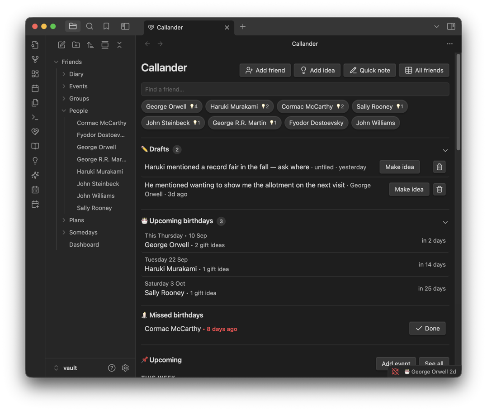
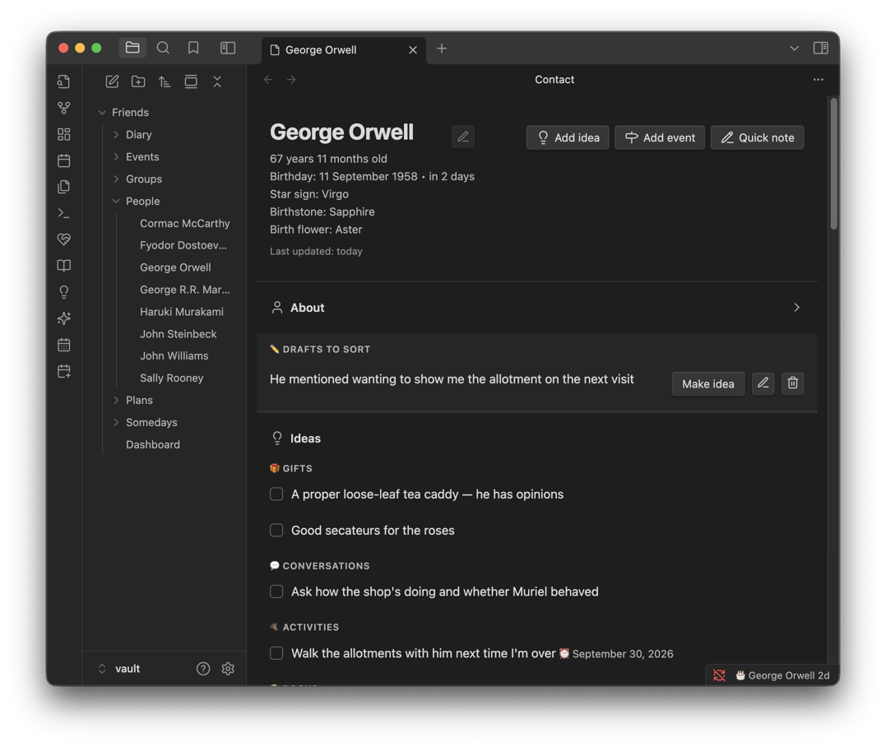
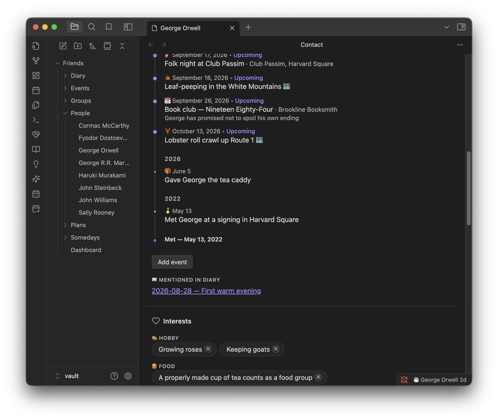

# Callander

**A private secondary memory for your friendships. Built with Obsidian.**

We all want to be better friends than our memory allows. You forget a birthday. You lose track of a great conversation that got interrupted. You see the perfect gift in a shop window, think "Sarah would love this," and by December you've completely forgotten it.

Callander is a quiet, personal space where you jot down the little things that help you show up well for the people you care about — and it resurfaces them when they matter.

You can also create reminders on the dashboard, manage a list of "Somedays" which are loose plans you'd like to do solo or in a group someday soon, and create full plans with as precise or imprecise of a timeline as you like, with a full cost breakdown tool and note taking.

This plugin is not designed to store opinions about people, ratings, or really even intimate details. It stores your _fascinations and excitements toward them_ — things you want to do, say, give, or remember.

My philosophy is that everything you record in this should in theory be totally okay for your friend to read about themselves.



More screenshots of the plugin can be found in the `examples/screenshots` folder.

## Features

### 🧑‍🤝‍🧑 A simple list of friends

Each friend gets their own page (a plain markdown note with frontmatter). A first name is all you need. Optionally add a birthday, a relationship type, and when you met.



### 💡 Ideas — the heart of it

On any friend's page, jot quick thoughts under five fixed categories:

- 🎁 **Gifts** — "saw a ceramic mug she'd love at that market stall"
- 💬 **Conversations** — "we got cut off talking about his career change"
- 🥾 **Activities** — "wants to try bouldering, invite him sometime"
- 📍 **Places** — "that ramen place would be perfect for catching up"
- ✨ **Other** — anything else

Ideas display grouped by category, so a ten-second glance before you see someone hands you gift ideas, conversation threads, and things to suggest doing. Check one off when it's done — and optionally log it on the timeline with one click.

**Quick capture from anywhere**: the "Add idea for a friend" command (assign it a hotkey!) fuzzy-picks a friend, takes a category and a thought, and files it — without ever leaving the note you were in.

### 🪧 Timeline

Log events — meetups, their life events, memorable outings — and see them newest-first under year headers, with the day you met as the timeline's origin point.



### 📅 Honest imprecision

You rarely remember the exact day you met someone. Callander lets you record dates as precisely as you actually know them:

- **Met**: "2019", "March 2021", or "March 14, 2021"
- **Birthdays**: exact date, month + year ("day unknown"), or month + day ("year unknown")
- **Events**: "May 2026" is a perfectly good answer to _when_

Everything displays at recorded precision — the app never pretends to know more than you do.

### 🎂 Birthdays that work like friendship works

Countdown ("birthday in 23 days"), a once-a-day startup digest of upcoming birthdays, and a **belated window**: for two weeks after a birthday it shows "birthday was 5 days ago" — so you can still send a belated message instead of feeling like you missed the window entirely.

### 📖 Diary

A simple private journal, separate from friends. Each entry has a title and — importantly — a **date the entry is about**, independent of when you wrote it. Backfill Tuesday's entry on Friday and it files itself under Tuesday. Entries are plain notes, edited in Obsidian's native editor.

## Principles

1. **Never creepy.** No fields for opinions, assessments, or sensitive personal details. If a feature would feel wrong if the friend saw it, it doesn't belong.
2. **Honest imprecision.** Record vague truths, not false precision.
3. **Ten-second capture.** The core loop is jotting a thought before it evaporates.
4. **Completely private.** Everything lives in your own vault as plain markdown. No sync, no network, no accounts.

## Development

```bash
npm install
npm run dev   # esbuild watch mode
```

Put the absolute path of a vault plugin folder (e.g. `<vault>/.obsidian/plugins/callander`) in a `.vault-plugin-path` file at the repo root (gitignored) — dev builds then output `main.js` there and copy `manifest.json`/`styles.css` along, which works with iCloud-synced vaults where symlinks won't sync. Pair with the [Hot Reload](https://github.com/pjeby/hot-reload) plugin for instant reload on rebuild (a `.hotreload` marker is written automatically). Without `.vault-plugin-path`, dev builds land in the repo root like the standard template. See `PLAN.md` for the roadmap.

## Credits

Callander is built on [Friend Tracker](https://github.com/dausign/obsidian-friend-tracker) by Dan Au. My decision to create a whole new project was made due to wanting a large overhaul of almost every feature, having different creative directions, and a faster development+deployment cycle that I can control. This project is MIT licensed, like the original.
