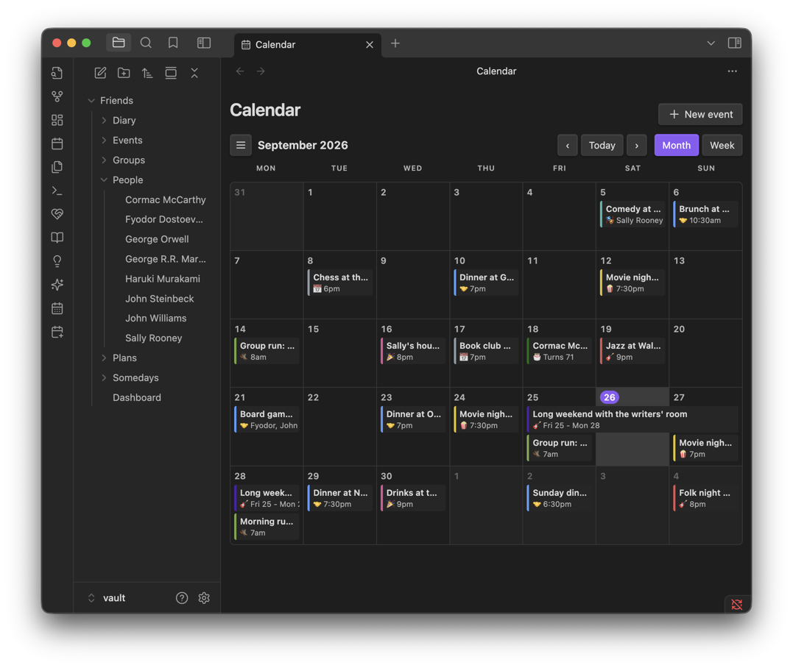
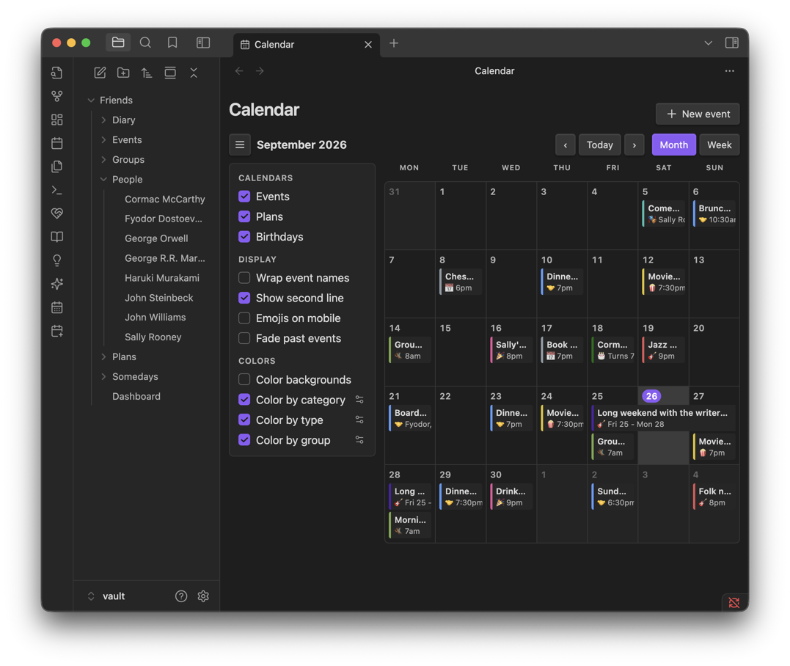
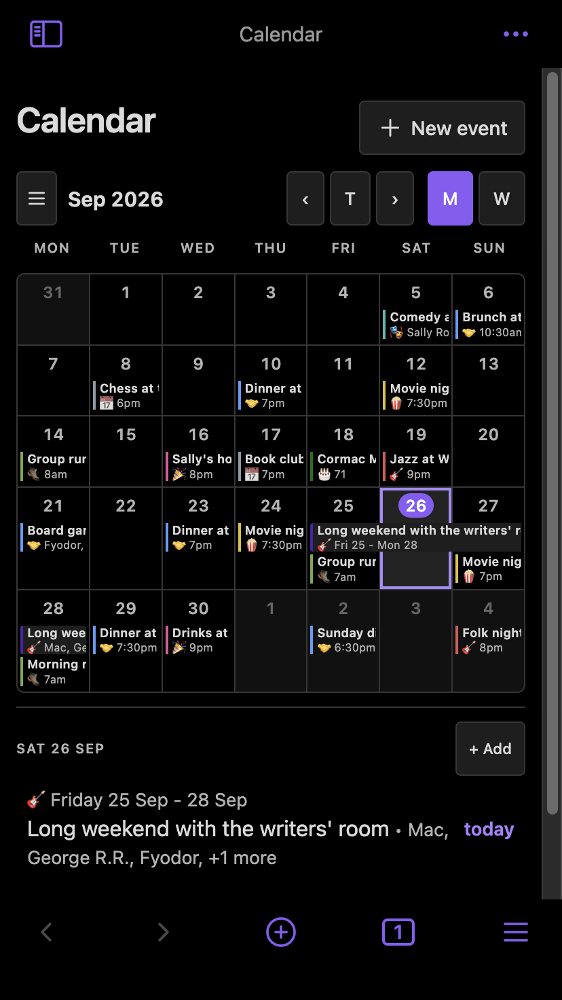

# Calendar

Events, plans and birthdays together on one calendar, a month or a week at a time. It's the whole picture — the [Events](EVENTS.md) page has its own Calendar tab too, but that one shows only events and plans; this page adds birthdays and is meant to be the place you look at everything dated at once.

**Contents**

- [At a glance](#at-a-glance)
- [Opening the calendar](#opening-the-calendar)
- [The grid](#the-grid)
- [The drawer](#the-drawer)
- [Event categories: show, hide, colour and filter](#event-categories-show-hide-colour-and-filter)
- [Tips & hidden details](#tips--hidden-details)
- [Screenshots](#screenshots)
- [Version history](#version-history)

**See also**

- [Events](EVENTS.md): event types, flexible dates, timezones and bulk import
- [Dashboard](DASHBOARD.md): the Upcoming section and the Calendar link
- [Plans](PLANS.md): how a multi-day plan draws on the grid

	
	 
	<em>Events, plans and birthdays together — a multi-day plan draws as one bar across its dates.</em>

## At a glance

- Month or Week view, with Today and the month/week arrows to navigate.
- Events, plans and birthdays each their own toggle in the drawer — hide any of the three kinds without leaving the page.
- **Event categories are the real filtering tool**: a free-form label you put on events (e.g. "NBA Games") that gets its own colour and its own show/hide toggle in the drawer.
- Clicking an empty day starts a new event already dated on it; clicking anything on the grid opens a short briefing.
- A multi-day plan draws as a single bar across the days it spans, rather than repeating on each one.

## Opening the calendar

- The dashboard's 📅 Calendar section — the whole row is a link, not an accordion that opens in place.
- The **Open calendar** command.

## The grid

- **Month** draws only the weeks that month touches, so most months don't carry a wholly empty row.
- **Week** lays out as a row per day, so names have room to wrap rather than being squeezed into narrow columns.
- A birthday shows as a 🎂 with the age they're turning (`Turns 32`).
- Clicking an **empty day** opens a new event pre-dated to that day.
- Clicking an **event, plan or birthday** opens a short briefing — what it is, who's involved, and a way into the full page — rather than jumping straight there.
- A day's own list appears underneath the grid once you select it, in Month view.

## The drawer

Open it with the ☰ beside the month name. It has three groups:

**Calendars** — tick Events, Plans or Birthdays off individually.

**Event category** — every category in use, each its own checkbox; a long list folds behind "Show N more" after the first few.

**Display**

| Option | Effect |
| --- | --- |
| Wrap event names | Full name over multiple lines instead of truncating |
| Show second line | A second line of detail under each name |
| Emojis on mobile | Chips lead with the event type's emoji instead of the name, on a phone |
| Fade past events | Dims anything from yesterday back to 65% opacity |

**Colors**

| Option | Effect |
| --- | --- |
| Color backgrounds | Fills the whole chip with its colour (auto black/white text), instead of just a left border |
| Color by category | Uses each category's own colour |
| Color by type | Uses each event type's colour |
| Color by group | Uses the group colour of whoever's on the event |

## Event categories: show, hide, colour and filter

A category is a free-form label you put on an event yourself — there's no fixed list. This is the real power tool on the calendar, and it's easy to miss because it's set from the *event* form, not from the calendar page.

**Worked example — an NBA team's games:**

1. Open (or add) one of the games, expand **Additional details**, tap **+ Add** under Categories and type `NBA Games`. Save the event. From then on `NBA Games` is offered as a chip on every other event.
2. Give it a colour in the same **+ Add** dialog, or later from the calendar drawer's **Choose category colors**.
3. Every event tagged `NBA Games` now shows that colour, wherever categories are coloured (see **Color by category** above).
4. Back on the calendar, open the drawer → **Event category**, and untick `NBA Games`. Every game vanishes from the grid — instantly hideable without deleting or cancelling anything.
5. Tick it again whenever you want the season back.

The same category also narrows the **Events** page: its Filters panel has a Category row next to Type and Person, on the List, Timeline and Calendar tabs alike.

**Colour priority.** With more than one "Color by…" toggle on, a category colour wins over a type colour, which wins over a group colour — the first one that actually matches an event is the one used. Turn one off to fall through to the next, or leave all three off to fall back to the plain purple accent.

**Renaming, recolouring or deleting a category.** Toggle **Edit** beside the "+ Add" chip in any event's category picker (shown as a round pencil). Tapping a category there lets you rename it, recolour it, or delete it. Deleting only removes the label — every event that had it keeps existing, just uncategorised.

## Tips & hidden details

- **The drawer's choices are remembered** across every time you open the page — you don't have to re-hide a category each session.
- **A same-day birthday gets a "Today!" treatment on the dashboard**, not here — see [Dashboard](DASHBOARD.md#sections).
- **The Events page's own Calendar tab is a subset of this page** — same grid, same drawer options, but only Events and Plans (no Birthdays), and its own Week toggle is hidden there now that this page covers it.
- **There's no separate category list to maintain.** The list is built from the categories your events actually carry, so a category disappears on its own once no event uses it — and deleting one from the picker simply takes it off every event.
- **Categories are case-insensitive.** `NBA Games` and `nba games` are the same category; whichever spelling was used first is the one shown.
- **Bulk import can tag a whole season at once** — see [Events](EVENTS.md#bulk-event-import). Import a schedule, put one category on every row at the confirmation step, and it's instantly toggleable here.
- **"Color backgrounds" picks readable text automatically** — it works out black or white per chip based on the background colour, so a bright yellow category doesn't render white-on-yellow.
- **Fade past events uses yesterday as the cutoff**, not "before now" — an event earlier today still reads at full strength.
- **Narrow panes drop to dots.** The grid responds to the *pane's* width, not the window's — a Calendar view in a narrow sidebar behaves like the narrow layout even on a wide monitor.

## Screenshots

	
	 
	<em>The drawer: which calendars show, how the grid draws, and what colours it by.</em>

	
	 
	<em>The same calendar on a phone, with the day's agenda listed underneath.</em>

## Version history

Derived from the [changelog](../CHANGELOG.md), newest first. Entries about event categories and colours apply here and on the Events page's own Calendar tab, since they share the same code.

**1.11.0** · 2026-09-30
- Days, and everything on them, open from the keyboard: Tab to one, then Enter or Space.
- Month paging no longer skips a month or stalls on the 29th–31st, here and on the Events page's Calendar tab.
- On a phone's month view, a plan's last day in the next week's row shows its date range, as a wide screen does. A plan also keeps its last day in time zones whose clocks change at midnight.
- At a width right around 620 pixels, the calendar no longer shows its wide and narrow layouts at once.
- The drawer's "Show N more" is plain again rather than a filled button.
- Renaming a category to one that already exists warns that the two will merge, and keeps the existing one's colour.

**1.10.3** · 2026-09-26
- The category Edit toggle becomes a round pencil, matching "+ Add"'s height.

**1.10.2** · 2026-09-26
- Categories gain colours: a dot on the chip, and the event's colour on both calendars.
- Edit beside "+ Add" can rename, recolour or delete a category.
- Timezones: an event's time can belong to a zone and shows converted to yours; a Plugin timezone setting and its banner.
- Times can be Anytime or TBD.
- On a phone, tapping an event selects its day.
- The drawer's category list folds after the first few, behind "Show N more".

**1.10.0** · 2026-09-21
- **The Calendar page is introduced** — events, plans and birthdays together, Month or Week, with the drawer described above.
- Colour, layered: Color by category / type / group, each its own toggle, applied in that priority order.
- Color backgrounds, with automatic black/white text.
- Fade past events.
- Event categories introduced: a free-form label, its own colour, filterable from the drawer.
- Bulk event import gains category assignment on the way in.
- A multi-day plan draws as one bar across its dates; hovering it highlights every row it spans.
- Make plan on an event's view seeds a new plan from it.

**1.9.2** · 2026-09-15
- Calendar chips give the event name its own line; an emoji the name starts with stands in for the type icon.
- On a phone, the month grid shows each event's emoji, three per day (or two plus a "+N").
- Picking a day no longer scrolls back to the top on a phone.

**1.9.1** · 2026-09-09
- A 🏀 Sports event type.

**1.9.0** · 2026-09-08
- The Events page's own Calendar tab introduced: Month or Week grid, click an empty day to add, click an event to open it.
- Narrow panes drop to dots, watching the pane's own width.

**1.8.0** · 2026-09-07
- 🥾 Activity event type.

**1.6.0** · 2026-08-18
- "Add to calendar" opens a prefilled Google Calendar entry for an event or plan timeline item.
- Event time becomes hour + minute dropdowns, with an optional Duration.
