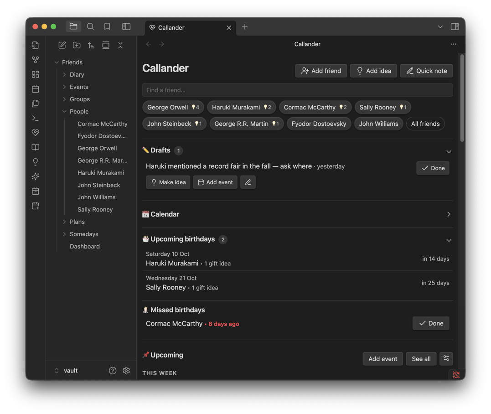
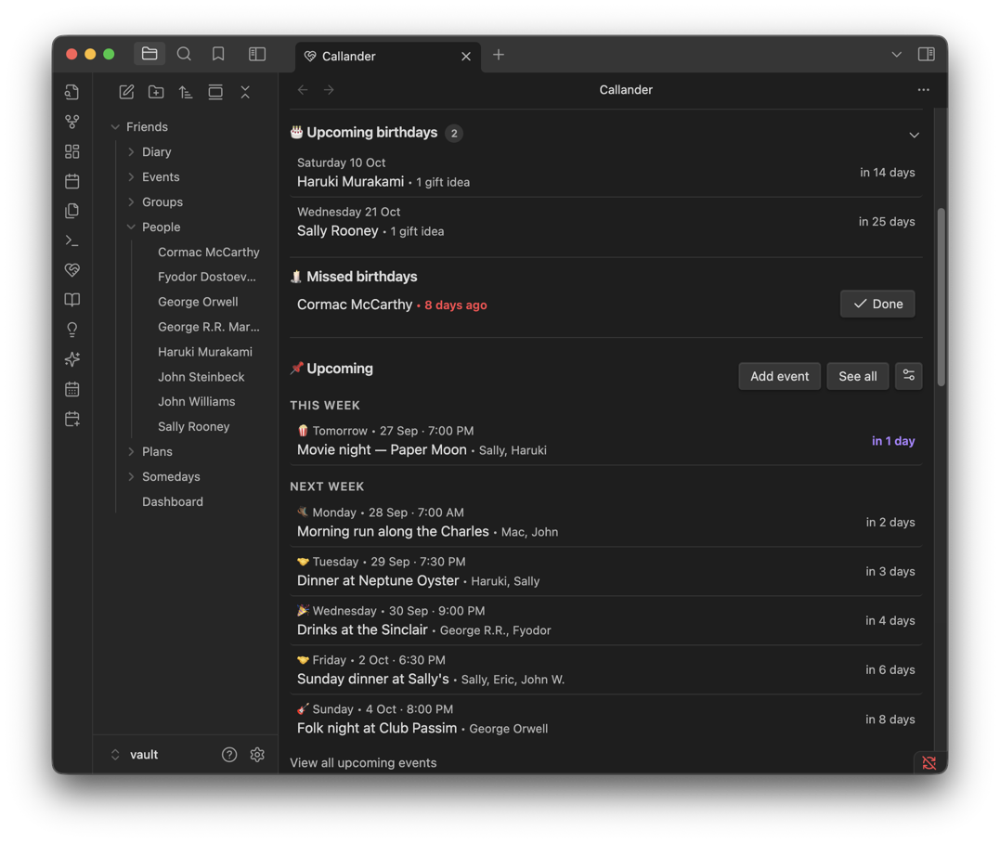
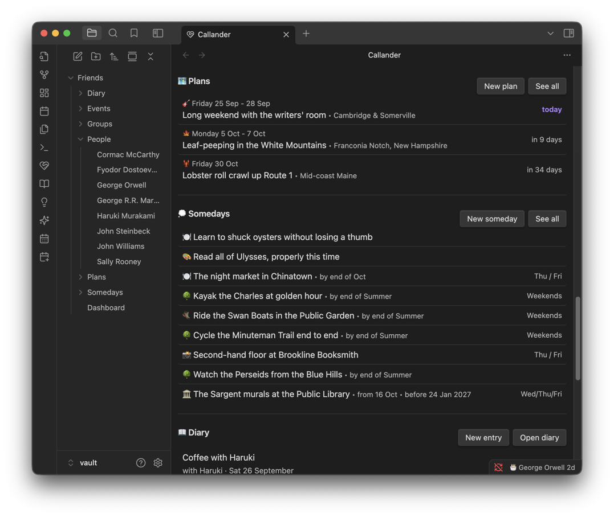
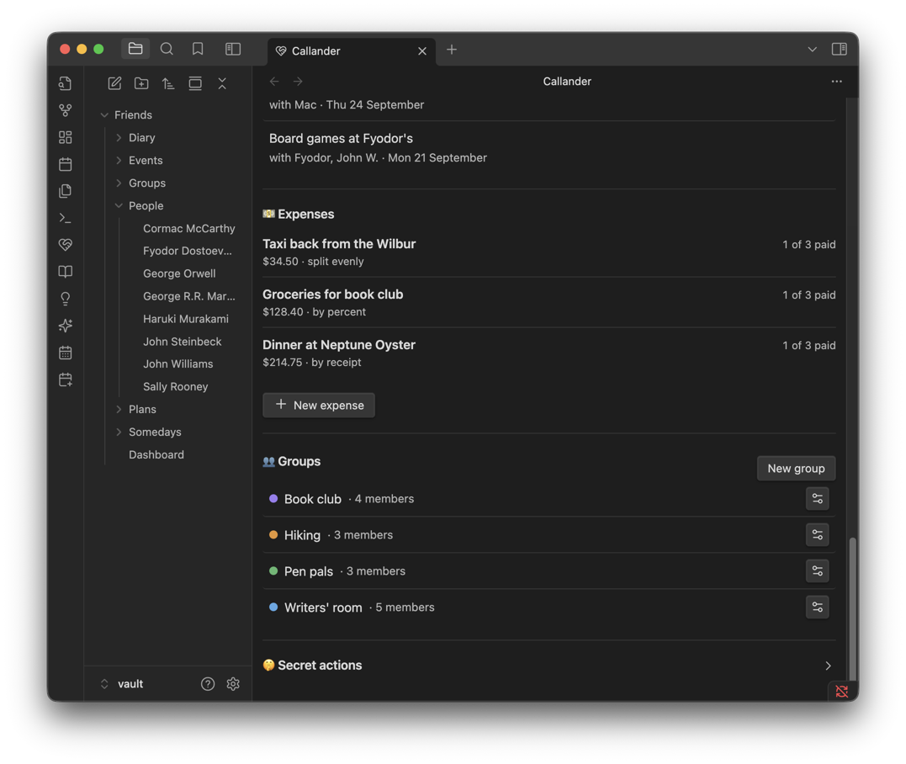
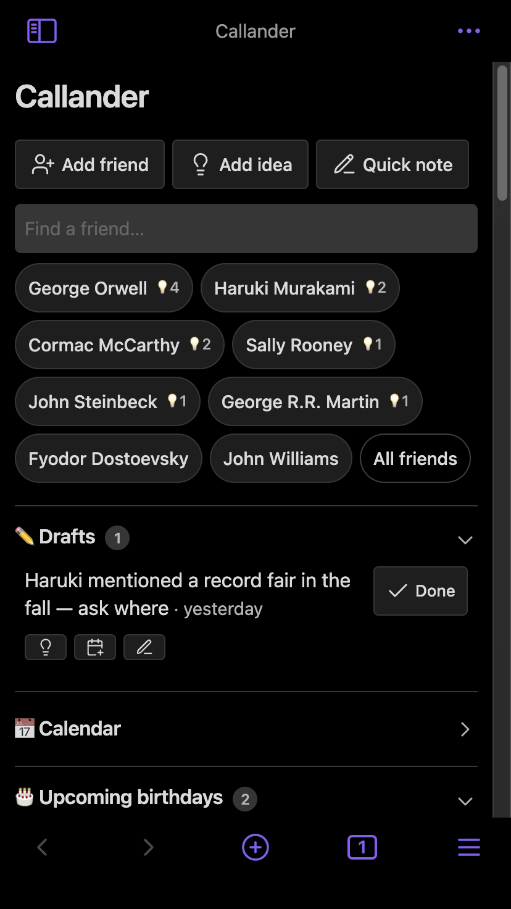

# Dashboard

The page you open first: everything read straight from your notes, so it can never fall out of date. It's a stack of sections, each optional and reorderable.

**Contents**

- [At a glance](#at-a-glance)
- [Header](#header)
- [Sections](#sections)
- [Reordering sections](#reordering-sections)
- [Settings](#settings)
- [Tips & hidden details](#tips--hidden-details)
- [Screenshots](#screenshots)
- [Version history](#version-history)

**See also**

- [Friends](FRIENDS.md): the friend chips and All friends page
- [Quick notes](QUICK-NOTES.md): drafts waiting to be filed
- [Ideas](IDEAS.md): the idea inbox and resurfacing
- [Calendar](CALENDAR.md): the full-page calendar the Calendar section links to
- [Events](EVENTS.md): what feeds the Upcoming section
- [Expenses](EXPENSES.md): ad-hoc costs without a plan

	
	 
	<em>Quick actions, friend search, and the notes waiting to be filed.</em>

## At a glance

- Three quick actions across the top: Add friend, Add idea and Quick note, above a friend search.
- Friend chips below the search bar show whoever you've interacted with most recently, then an **All friends** button.
- Fifteen sections, which (on Obsidian 1.13+) can be dragged into any order. A section with nothing to show hides itself.
- Nothing here is a separate database — every section reads live off your existing notes.

## Header

**Add friend**, **Add idea** and **Quick note** sit above a search bar. Below it, chips for your most recently touched friends end with an **All friends** button that opens the full list. Typing in the search bar switches the chips from "recently touched" to an alphabetical match across name, display name and group.

## Sections

In shipped order:

| Section | What it shows |
| --- | --- |
| ✏️ Drafts | Quick notes not yet filed — see [Ideas & interests](IDEAS.md) |
| 👋 Getting started | A 9-step checklist for a new vault; see below |
| 📅 Calendar | A closed accordion that's really a link — tapping it opens the full [Calendar page](CALENDAR.md) |
| 🎂 Upcoming birthdays | Countdown through the next 30 days, with a gift-idea flag |
| 🕯️ Missed birthdays | Birthdays passed within the belated window, each with a Done to tick off |
| 📌 Upcoming | Events and plans for this week and next, in one timeline |
| 🕰️ On this day | Timeline events from this date in a previous year |
| 🗺️ Plans | Upcoming plans — see [Plans](PLANS.md) |
| 💭 Somedays | The undated wishlist — see [Somedays](SOMEDAYS.md) |
| 📖 Diary | Recent entries — see [Diary](DIARY.md) |
| 💵 Expenses | One-off costs split without a plan — see [Expenses](EXPENSES.md) |
| 👥 Groups | Every group, with member counts — see [Groups](GROUPS.md) |
| ⏰ Resurfacing now | Ideas whose resurface date has arrived |
| 📥 Idea inbox | Ideas captured with no friend picked yet, each with **File to friend…** |
| 🤫 Secret actions | Folded-away, less-common actions — currently just Bulk event import |

A section with nothing to show hides itself rather than displaying empty — On this day, Resurfacing now and the Idea inbox all disappear entirely when there's nothing in them.

### Getting started

A nine-step checklist that walks a new vault through its first friend, group, quick note, name in settings, event, someday, plan, diary entry and opening the calendar. Each step ticks itself off as the vault shows it done — sticky, so a step doesn't un-tick if the thing you did no longer applies (the test friend you deleted, say). **Hide this section** removes it; **Show getting started** in [Settings](SETTINGS.md#dashboard) brings it back.

### Upcoming

Its own settings (⚙ in the section header) choose:

- Which calendars feed it — Events, Plans, or both.
- Filters for event type and category.

A task whose day has passed stays here, flagged **Overdue**, until it's ticked **Done** — every other kind of event or plan simply drops off once its day is over. See [Events](EVENTS.md) for how a same-day event with a start time and duration behaves once that time is up.

## Reordering sections

On **Obsidian 1.13 and later**, drag any section into a new position under **Dashboard sections** in the plugin's settings. A section added by a future update slots in where it ships, rather than always landing at the bottom of your custom order. On older Obsidian versions the control doesn't appear and the shipped order is used.

Sections can't be switched off individually. Most hide themselves when empty (On this day, Resurfacing now, Idea inbox, Missed birthdays, Drafts), and Getting started has its own setting.

## Settings

| Setting | Default | Effect |
| --- | --- | --- |
| Show getting started | on | The onboarding checklist |
| Friend suggestions shown | 9 | How many chips appear when the search bar is empty |
| Somedays shown | 10 | How many somedays list before the rest become a "+N more" link |
| Belated birthday window | 14 days | How long a missed birthday stays in Missed birthdays |
| Limit page width | on | Keep the page to a reading column; the button in its top corner widens it for the visit |
| Dashboard sections | shipped order | Drag to rearrange; Obsidian 1.13+ |

All of these live in [Settings](SETTINGS.md).

## Tips & hidden details

- **Friend chips are ordered by file modified time, not alphabetically.** Adding an idea, logging an event, editing a draft about them, or any other touch to their note bumps them back to the top of the list — the dashboard is always showing who you've actually been thinking about lately, not a fixed roster.
- **Search matches group names too.** Typing a group's name in the friend search surfaces everyone in it, not just people whose own name matches.
- **The 💡3 badge on a friend chip** counts their *open* ideas of any kind — done ones don't count. (Upcoming birthdays, by contrast, counts gift ideas only.)
- **The Calendar section is a link in disguise.** It's drawn as a closed accordion to match the sections around it, but it never actually opens — clicking anywhere on it, including the keyboard Enter/Space, jumps straight to the full Calendar page instead.
- **A same-day birthday can be dismissed for the day** without waiting for it to become "missed" — a birthday due today shows a "Today!" label and a Done button in place of the countdown, right here in Upcoming birthdays.
- **Ad-hoc expenses need no plan.** The Expenses section's own "New expense" opens the same split-five-ways modal a plan's Cost breakdown uses, for a cost that doesn't belong to any trip.

## Screenshots

	
	 
	<em>Birthdays with gift ideas flagged, missed ones held for you, and what's coming up.</em>

	
	 
	<em>Trips you're planning, and the wishlist of things without a date yet.</em>

	
	 
	<em>The tail of the page: recent entries, your groups, and money still to settle.</em>

	
	 
	<em>The same dashboard on a phone — draft actions collapse to icon-only to fit the row.</em>

## Version history

Derived from the [changelog](../CHANGELOG.md), newest first.

**1.10.4** · 2026-09-26
- A birthday due today shows a bold "Today!" and a filled Done button in place of the countdown.

**1.10.3** · 2026-09-26
- A draft's View person, Make idea and Add event gain icons; on a phone the labels drop to fit the row.
- Add friend's placeholder text is clearer about what each field is for.

**1.10.2** · 2026-09-26
- Quick notes and drafts move into a `## Drafts` checklist in the dashboard note; Done ticks rather than deletes.
- A draft's Edit can reassign who it's about.
- Friend suggestion count becomes a setting.
- A new group can be made from the Add friend form.

**1.10.0** · 2026-09-21
- Getting started section added, replacing the single seeded example friend.
- Upcoming gets its own settings modal (calendars, type and category filters).
- Drafts gain View person, Make idea and Add event actions per row.

**1.9.2** · 2026-09-15
- Plans appear in Upcoming, with Hide from this list / Show in Upcoming.
- Rows name up to three people, then "+N more".

**1.9.0** · 2026-09-08
- Sections become reorderable by drag, on Obsidian 1.13+.
- Expenses moves above Groups in the shipped order.
- Upcoming becomes this-week-and-next rather than a rolling day count; the window setting retires.

**1.8.0** · 2026-09-07
- Upcoming becomes a timeline grouped by how soon.

**1.4.0** · 2026-08-10
- Ad-hoc expenses added — split a one-off cost without creating a plan.
- Dashboard timestamps show relative times ("Today", "Tomorrow", a countdown).

**1.3.0** · 2026-08-03
- Upcoming gains a configurable window (default 30 days); today/tomorrow purple, overdue red.
- Fresh installs seed folders and an example friend on first open.

**1.0.1** · 2026-07-28
- Dashboard introduced: upcoming birthdays, upcoming events and reminders, search, quick actions.
