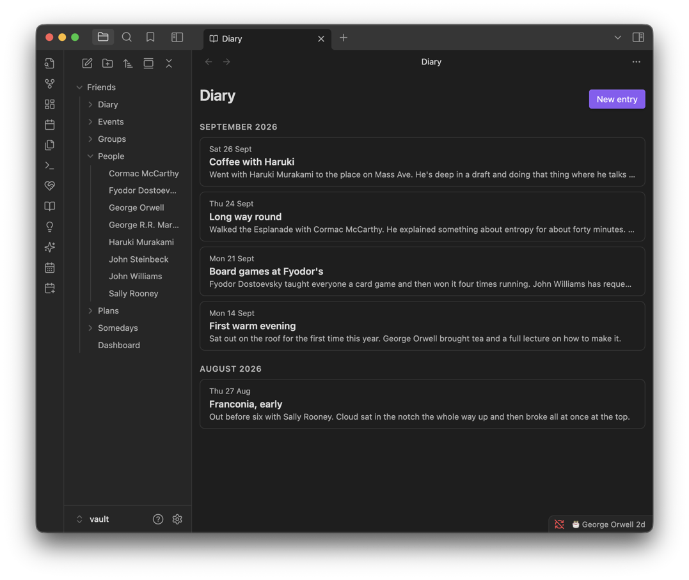

# Diary

For writing about a day, rather than filing a fact. Link a friend with `[[their name]]` and the entry finds its own way onto their page — nothing else to tag or fill in.

**Contents**

- [At a glance](#at-a-glance)
- [Writing an entry](#writing-an-entry)
- [Automatic linking](#automatic-linking)
- [Logging an entry to friends' timelines](#logging-an-entry-to-friends-timelines)
- [Tips & hidden details](#tips--hidden-details)
- [Version history](#version-history)

**See also**

- [Friends](FRIENDS.md): where a diary mention shows up on someone's page
- [Dashboard](DASHBOARD.md): the Diary section

	
	 
	<em>Write about the day; a <code>[[link]]</code> to someone puts it on their page.</em>

## At a glance

- Entries are grouped by month, each showing a preview of what you wrote.
- Mentioning a friend with a real `[[wikilink]]` is what links the entry to them — no separate field to fill in.
- Each entry is just a note, written however you like.

## Writing an entry

**New entry** (or the **New diary entry** command) asks only for a title and a date; the entry itself opens as a real Obsidian note, in Obsidian's own editor — so `[[` autocomplete, your hotkeys and every other installed plugin all work normally while you write.

Entries live in the diary folder (`Friends/Diary` by default) and are named `<date> <title>.md`, e.g. `2026-09-24 Coffee with Haruki.md`. Changing the title or date renames the file to match.

## Automatic linking

A diary entry shows up on a friend's page the moment it contains a genuine wikilink to them — resolved from Obsidian's own link index, not by scanning the text of every entry for a name. That means:

- Writing their name in plain text does nothing; it needs to be an actual `[[Their Name]]` link.
- The entry then appears on their page, under their Timeline.
- Renaming a friend keeps every past diary entry linked to them, since Obsidian updates the link automatically.
- The Diary Mentions shown on someone's page cost nothing to compute — they're read straight off the link graph you already have.

## Logging an entry to friends' timelines

A diary mention is a link, not an event. To put the day on everyone's timeline as an event too, open the entry and run **Log diary entry to friends' timelines**. It creates one event dated to the entry, on the timeline of every friend the entry links to.

- The event stays **in sync with the entry**: change its title or date, link another friend, or remove a link, and the event follows. Renaming the entry keeps it attached. An entry you never logged is left alone.
- The command only appears while a diary entry is the active note, and needs the entry to have a date and at least one linked friend.

## Tips & hidden details

- **Nothing shows on a friend's page for a plain-text mention** — if autocomplete didn't turn a name into a link as you typed, go back and wrap it in `[[ ]]` yourself.
- **A diary mentions section only appears when there's something to show** — no empty heading implying you'd written about someone when you hadn't.
- **The filename is the date plus the title**, so entries sort chronologically in the file explorer on their own.
- **Two entries with the same date and title** get a number on the end rather than overwriting each other.

## Version history

Derived from the [changelog](../CHANGELOG.md), newest first.

**1.11.0** · 2026-09-30
- The Diary page shows a new entry straight away, and redraws once per save rather than twice.
- An entry's header opens and closes from the keyboard.
- Editing a logged entry updates its event with the friends it mentions now, and keeps the event off people's timelines if you'd taken it off.
- Logging an entry that fails to save says so.
- The dashboard's Diary section notices entries in a diary folder kept outside the Callander folder.

**1.9.0** · 2026-09-08
- Every page (the Diary included) is kept to the same reading-column width, with a button to widen it for as long as you're on the page.

**1.8.0** · 2026-09-07
- Fixed: a new diary entry's date (and its filename) used to record on the UTC day rather than yours — an evening in the US could stamp tomorrow, a morning in Australia, yesterday.

**1.0.1** · 2026-07-28
- Diary introduced: dated entries, edited natively, linking into friends' timelines.
