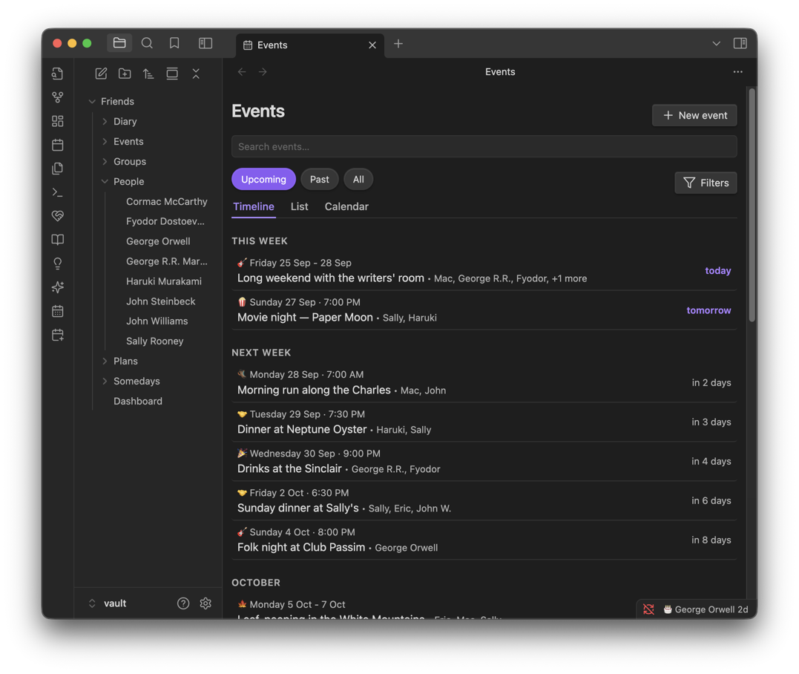
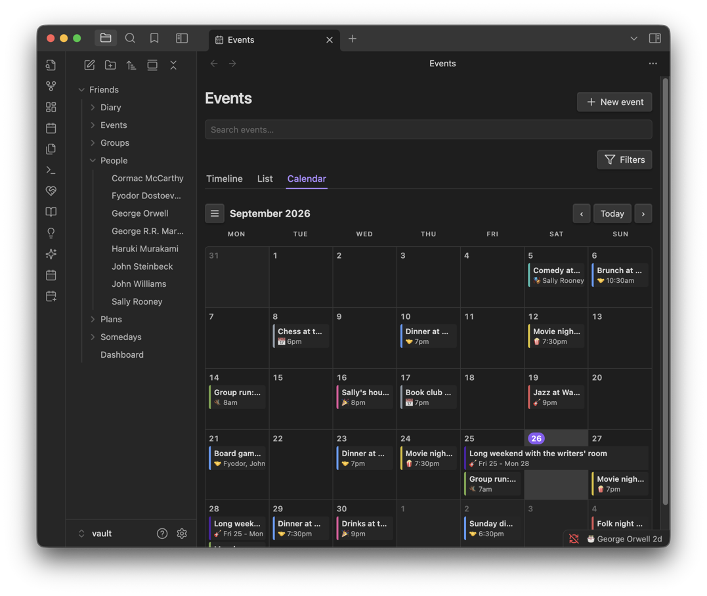
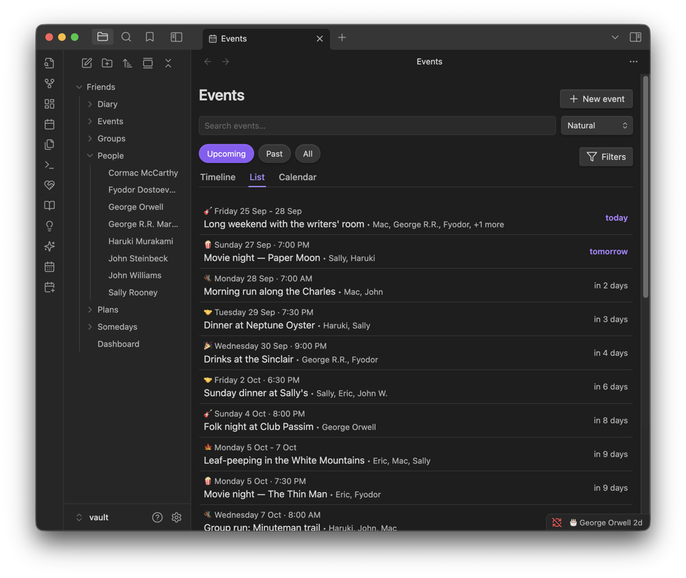
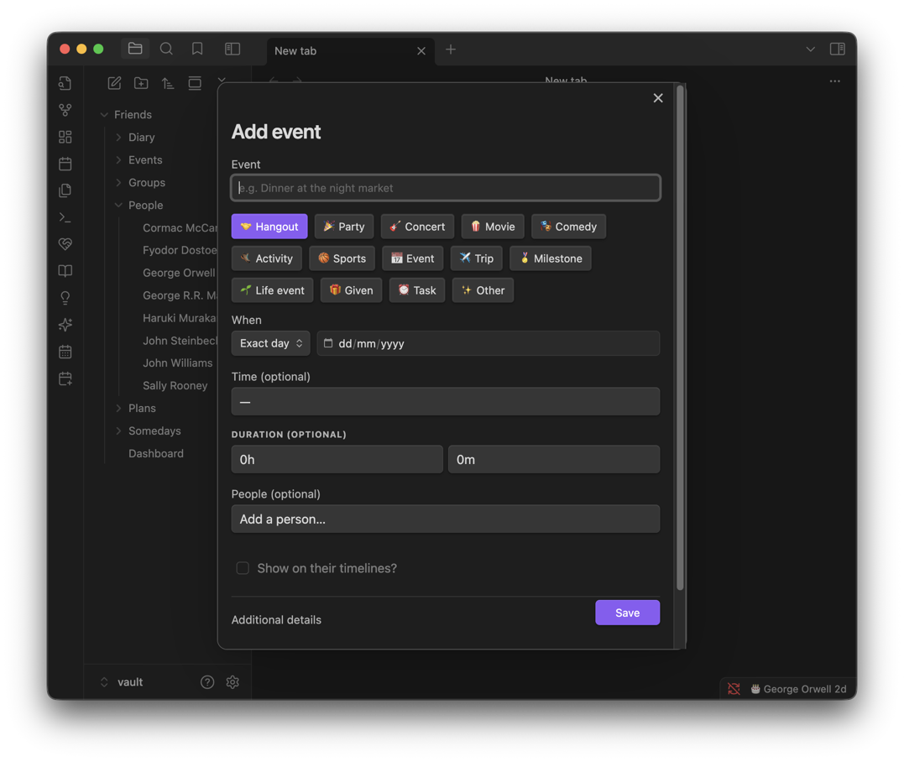
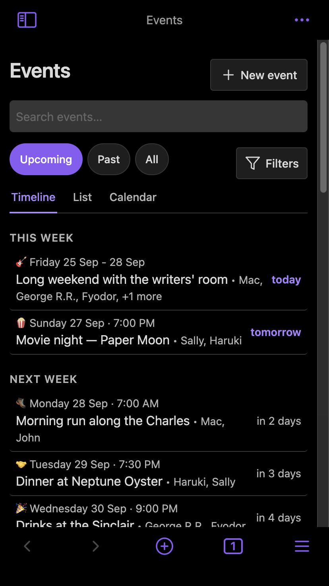

# Events

Anything with a date on it, past or future — a dinner, a gig, someone's big news, a gift you handed over, or a plain task with nobody attached at all.

**Contents**

- [At a glance](#at-a-glance)
- [Logging an event](#logging-an-event)
- [Event types](#event-types)
- [The Events page](#the-events-page)
- [Flexible dates and times](#flexible-dates-and-times)
- [Timezones](#timezones)
- [Categories](#categories)
- [Cancelling](#cancelling)
- [Bulk event import](#bulk-event-import)
- [Tips & hidden details](#tips--hidden-details)
- [Screenshots](#screenshots)
- [Version history](#version-history)

**See also**

- [Calendar](CALENDAR.md): categories used to show, hide, colour and filter events
- [Dashboard](DASHBOARD.md): the Upcoming section events feed into
- [Friends](FRIENDS.md): an event on a person's own timeline

	
	 
	<em>Grouped by how soon rather than by date — this week, next week, then by month.</em>

## At a glance

- Log anything with a date: a hangout, a task, a milestone, a gift given.
- The date can be as vague as you like — a full date, a month, or just a year.
- Three views on the Events page: Timeline, List, Calendar.
- Categories are free-form labels you invent — a team's name, "Sports" — and are the main way to filter and colour events. See [Calendar](CALENDAR.md#event-categories-show-hide-colour-and-filter).
- Cancelling keeps the record (crossed out, labelled); nothing is deleted.

## Logging an event

Pick a type from a row of options, give it a date (as vague as you like), and choose who was there. **Show on their timelines?** decides whether it appears on the people you tagged, or stays private to your own calendar.

Other ways in:

| From | How |
| --- | --- |
| Dashboard, Events page, Calendar page | **New event** / **Add event**, or the **New event** command |
| A friend's page | **Add event**, with them already on it |
| An empty day on a calendar | Starts a new event already dated to that day |
| A ticked-off idea | Ticking an idea done offers to log it as an event |
| Several friends at once | The **Log a shared event (several friends)** command — "bowling with the basketball crew" |
| A someday | **Make event** on the someday |
| A diary entry | **Log diary entry to friends' timelines** — see [Diary](DIARY.md#logging-an-entry-to-friends-timelines) |

## Event types

🤝 Hangout · 🎉 Party · 🎸 Concert · 🍿 Movie · 🎭 Comedy · 🥾 Activity · 🏀 Sports · 📅 Event · ✈️ Trip · 🏅 Milestone · 🌱 Life event · 🎁 Given · ⏰ Task · ✨ Other

Each type has its own default colour, used wherever **Color by type** is on (see [Calendar](CALENDAR.md#the-drawer)). A **Task** is the one type that doesn't quietly stop mattering once its day is over — see [Dashboard](DASHBOARD.md#sections).

## The Events page

| Tab | Shows |
| --- | --- |
| **Timeline** | Grouped by how soon: This week, Next week, Later this month, then by month. The default. |
| **List** | The flat, sortable version. |
| **Calendar** | A month or week grid — see [Calendar](CALENDAR.md), which this shares its drawer and colour settings with. |

Filter by **Upcoming**, **Past** or **All**, and further by Type, Person or Category. Looking backwards, month headings carry their year (August 2025 vs. August 2026), and Past reads newest first: This week, Last week, Earlier this month, then by month and year.

## Flexible dates and times

A date can be as precise as you actually know it — a full day, a month and year, or only a year — rather than forcing a made-up day onto something you remember as "sometime in 2019."

A time can be an exact clock time, or one of two special values:

| Value | Meaning |
| --- | --- |
| Anytime | It happens, but there's no meaningful time of day |
| TBD | A time is coming, but isn't settled yet |

## Timezones

An event's time can belong to a specific zone, and is shown converted to yours, with the original alongside where it matters. A **Plugin timezone** setting pins every time to one zone regardless of your device's own; while your device disagrees with it, a banner on the Dashboard, Events and Calendar pages says so, and can be snoozed.

## Categories

A category is a free-form label — invent one on the spot under **Additional details** when adding or editing an event, or pick one already in use. Each has its own colour. The full show/hide/colour/filter workflow, including a worked example, lives in [Calendar](CALENDAR.md#event-categories-show-hide-colour-and-filter).

## Cancelling

Cancelling an event is a soft delete: it stays on the list, crossed out and labelled **Cancelled**, rather than being removed. An evening that didn't happen is still part of the story — and it's reversible.

## Bulk event import

For a whole batch at once — a season of games, a term of classes, a run of repeating events. Lives in the dashboard's 🤫 Secret actions section.

The modal gives you the format to copy (**Click to copy**), and a **Copy prompt** button with instructions ready to paste into an AI chat — "every remaining game this season" is exactly the kind of thing to ask for. Paste CSV with these columns (a header row is optional but recommended, and with one the columns can come in any order):

| Column | Example |
| --- | --- |
| Name | Celtics vs Knicks |
| Date | 2026-10-22 |
| Time | 19:30 |
| Timezone | *(blank for floating)* |
| Duration | 2h 30m |
| Type | sports |
| Location | TD Garden, Boston |
| People | Haruki Murakami; John Steinbeck |
| Link | https://example.com/tickets |
| Description | Home opener |

It checks every line as you type, pointing at anything it can't read. Before writing anything, a confirmation screen shows how many events there are, flags names that repeat or already exist and people it can't find, and lets you put one or more categories on the whole batch at once. **There's no bulk undo**, so it asks you to be sure before committing.

## Tips & hidden details

- **A category isn't a CSV column** — it's applied to the whole imported batch on the confirmation screen, not per row. Run the import twice for two differently-categorised batches.
- **The example row can be left in** — it's there to show the format, and the instructions say so.
- **"People" is semicolon-separated** (`Sally Rooney; Haruki Murakami`), and names are matched to existing friends — anyone it can't find is flagged on the confirmation screen.
- **Leaving Time blank makes it an all-day event** — that's different from writing "Anytime," which is a deliberate value rather than an absence.
- **The Timezone column can be left blank** even when other rows have one — a floating time (no zone) is the default and always was, before this feature existed.
- **A cancelled event still counts everywhere its date would** — Past/All filters and month headings still include it, just visibly struck through.
- **Narrow panes on the Calendar tab watch the pane's own width, not the window's** — a sidebar Events view on an otherwise-wide monitor still gets the narrow layout.

## Screenshots

	
	 
	<em>The same events as a month grid. Clicking an empty day starts a new one, already dated.</em>

	
	 
	<em>The flat, sortable List tab.</em>

	
	 
	<em>Pick the kind of thing it was, and be as vague about the date as you need to be.</em>

	
	 
	<em>The same page on a phone.</em>

## Version history

Derived from the [changelog](../CHANGELOG.md), newest first.

**1.11.0** · 2026-09-30
- Rows open from the keyboard: Tab to one, then Enter or Space.
- Dates read day first, "14 March 2019", and one that can't exist, like 30 February, reads as no date rather than the wrong one.
- The move from reminders to events no longer deletes a note of your own called `Reminders.md`, or an empty `Reminders` folder. Reminder notes that sync in from a device on an older version are sorted into calendar entries and timeline records straight away, rather than at the next launch.
- A note in Events whose properties can't be read is skipped, rather than turning off birthday reminders and the status bar on every start.
- Search keeps the Timeline or Calendar tab you're on, and keeps what you're typing when the page refreshes.
- Opening an event's note opens it whatever tab, filter or search is showing, and no longer pops it open again some later day.
- Plans sort by their own dates under Oldest and Last updated, and a friend's new display name shows without waiting for an event to change.
- An event saved with "Show on their timelines?" unticked stays off that friend's own page too.
- `mailto:`, `tel:` and `sms:` links open and share as themselves, and a Google Calendar link lasts its full length across the night the clocks go back.
- Month paging on the Calendar tab no longer skips a month or stalls on the 29th–31st.
- Renaming a category to one that already exists warns that the two will merge, and keeps the existing one's colour.
- Bulk import: a stray quote, as in `12" pizza`, no longer merges the rows after it, line breaks inside a quoted cell come through without stray characters, and time zones are stored in their proper form ("Europe/Madrid").

**1.10.3** · 2026-09-26
- The category Edit toggle becomes a round pencil, matching "+ Add"'s height.

**1.10.2** · 2026-09-26
- Categories gain colours; Edit renames, recolours or deletes one.
- Timezones introduced, with a Plugin timezone setting and its banner.
- Times can be Anytime or TBD.
- On a phone, tapping an event selects its day.
- Overdue events stay in Upcoming until dealt with, instead of dropping off after a week.
- The edit form's "Copy to…" button is removed; add people in the People field instead.
- Bulk import's instructions gain clarity on timezones and the example row.

**1.9.2** · 2026-09-15
- Past reads newest first. Calendar chips give the name its own line, with a leading emoji standing in for the type icon.
- On a phone, the month grid shows each event's emoji, three per day (or two plus "+N").
- Rows name up to three people, then "+N more".

**1.9.1** · 2026-09-09
- A 🏀 Sports event type.

**1.9.0** · 2026-09-08
- A Calendar tab: month or week grid, click an empty day to add, click an event to open it.
- Filters gain a label and move onto the Upcoming/Past/All line; now work on the Timeline too.

**1.8.0** · 2026-09-07
- A Timeline tab, now the default, grouped by how soon. Past/All month headings gain their year.
- A 🥾 Activity event type.

**1.4.0** · 2026-08-10
- Filter pills (Upcoming/Past/All) replace sort options.
- Events can be cancelled as a soft delete, with restoration.
- Toggles added for showing an event on friend timelines or the dashboard.
