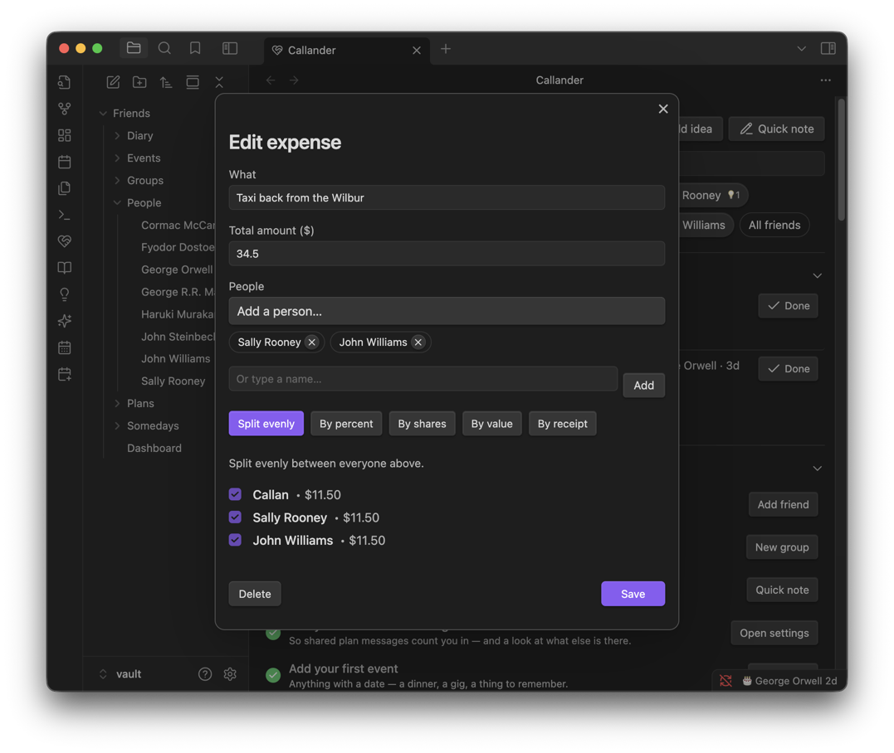
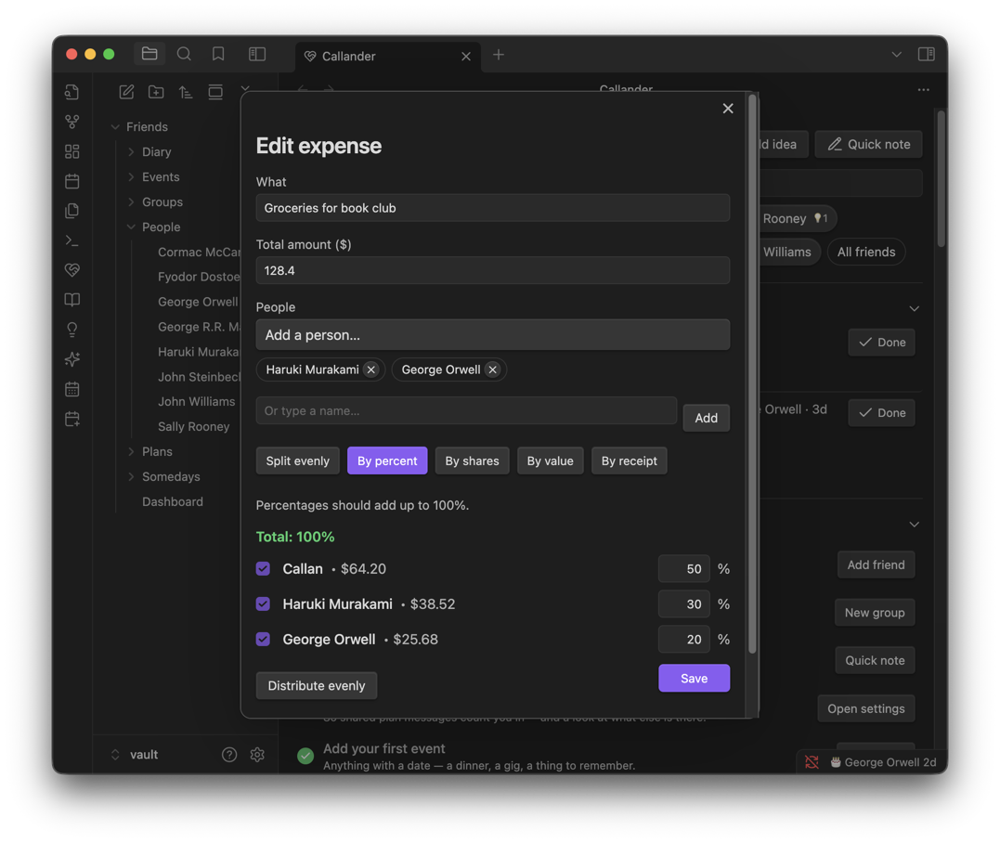
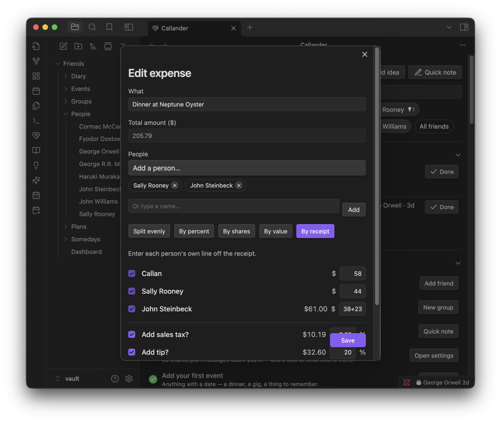
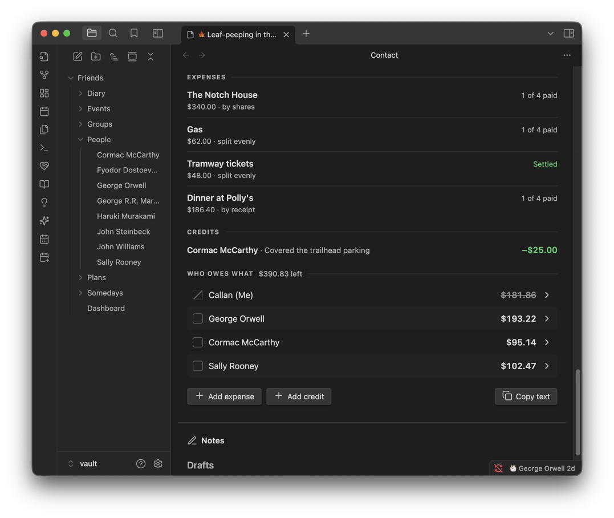
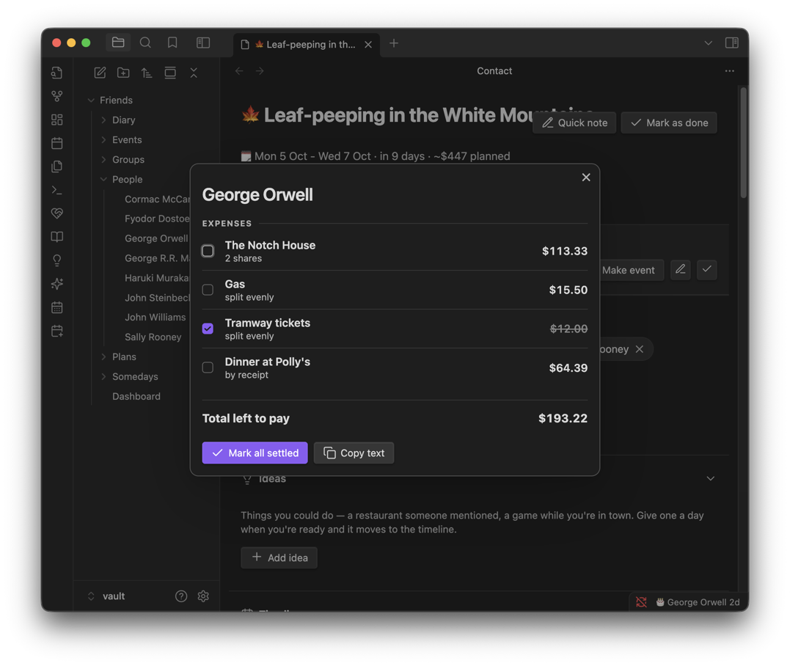

# Expenses

Splitting and settling shared costs — on a plan's Cost breakdown, or as a one-off from the dashboard with no plan at all.

**Contents**

- [At a glance](#at-a-glance)
- [Starting an expense](#starting-an-expense)
- [The five split modes](#the-five-split-modes)
- [Arithmetic in an amount field](#arithmetic-in-an-amount-field)
- [Tax and tip](#tax-and-tip)
- [Credits](#credits)
- [Who owes what, and the ledger](#who-owes-what-and-the-ledger)
- [Settling up](#settling-up)
- [Tips & hidden details](#tips--hidden-details)
- [Screenshots](#screenshots)
- [Version history](#version-history)

**See also**

- [Plans](PLANS.md): the Cost breakdown section this mostly lives inside
- [Dashboard](DASHBOARD.md): the Expenses section for costs with no plan

	
	 
	<em>Splitting a cost evenly between three people.</em>

## At a glance

- Five ways to split a cost: evenly, by percentage, by shares, by exact amounts, or line by line off the receipt.
- **Receipt mode accepts arithmetic** — type `8+(4*9.5)` in a person's line and it evaluates to $46.00, while still showing you typed `8+(4*9.5)`.
- Tax and tip are each a percentage of the subtotal — not stacked on each other.
- A credit takes money *off* what someone owes, kept apart from the costs so it never reads as one more thing they owe.
- Everything rolls up to one figure per person, and a tap opens their full ledger to settle from.

## Starting an expense

- **On a plan:** its Cost breakdown section, **New expense**.
- **With no plan:** the dashboard's 💵 Expenses section, **New expense** — for a one-off like dinner, a taxi, or groceries that doesn't belong to a trip.

Every expense needs a label, an amount (or a full split, depending on mode), and who it's for.

## The five split modes

| Mode | How it works |
| --- | --- |
| **Evenly** | Name who was there; it divides equally. |
| **By percent** | Give each person a percentage. A running total shows whether you've reached 100%. |
| **By shares** | Give each person a whole-number share (e.g. 3 nights to one person, 2 to another) — easier to think about than percentages when the units are real things. |
| **By value** | Type each person's exact dollar amount directly. |
| **By receipt** | Type each person's own line straight off the bill, as text — see arithmetic below. |

## Arithmetic in an amount field

**Receipt mode's amount fields accept expressions, not just numbers** — the four basic operators and parentheses. Typing `8+(4*9.5)` shows a live preview of `$46.00` while keeping the expression itself as what's saved, so re-opening the split later still shows `8+(4*9.5)` rather than a bare `46`. That's deliberate: a stored `38+23` stays readable as *how* you got to $61, not just the total.

- Supported: `+  -  *  /  ( )`, decimals, and whitespace.
- An incomplete or invalid expression (`7+`, a stray letter) shows **Invalid** rather than silently guessing.
- This only applies in **By receipt**. **By value** takes a plain number.
- The evaluator is hand-written rather than JavaScript's `eval`, on purpose — an amount field has no business running arbitrary code.

## Tax and tip

Both are set as a **percentage of the subtotal**, in Receipt mode:

- **"Add sales tax?" and "Add tip?" are offered as tick boxes** on the split, each pre-filled with a default percentage (6.25% and 20%) you can change per expense.
- Whether they're offered **at all** is itself a plugin setting — see [Settings](SETTINGS.md#cost-breakdown) — on by default for both. Turn one off if, say, tipping isn't done where you live; an expense that already has one keeps showing it regardless.
- They're charged on the subtotal, not stacked on each other — 6.25% tax and 20% tip on a $100 subtotal is **$126.25**, not $127.50 from tipping on the already-taxed amount.
- Each shows the dollar figure it adds, so the receipt total is easy to check against the paper one before saving.

## Credits

A credit is the other half of an expense: money coming **off** what someone owes, rather than one more thing they owe.

- Use it when somebody covers a shared cost you'd rather not log and split back out — petrol, say.
- Carries its own note saying what it was for. A credit with no note says so explicitly, rather than leaving the line blank.
- Listed under its **own heading**, apart from the expenses — so money coming off never gets mistaken for one more cost going on.
- Shows inline as `+$20.00` when it appears alongside expenses.

## Who owes what, and the ledger

Every split rolls up into **one figure per person**, shown in the open (not behind a disclosure) since it's the number you actually came to check.

Tap anyone's row to open their **ledger**:

- Every cost they're charged for, and how it was split.
- The credits coming off it.
- The total still left to pay.
- Their own row is visually marked as what it is — a slashed checkbox and a struck-through figure, since you can't owe yourself.

Nobody has to take the arithmetic on trust — the whole point of the ledger is that every number is traceable back to a line.

## Settling up

From a person's ledger:

- **Tick a single line** as they hand that share over.
- Or **mark the lot settled** in one go.

The outstanding figure updates as you go, so someone who's square reads **$0.00** — not a struck-through row still showing what they used to owe.

## Tips & hidden details

- **`8+(4*9.5)` in a receipt line isn't a party trick — it's the intended way to copy a complicated bill.** If a menu item split three ways plus a shared appetizer is easier to write as an expression than to work out in your head first, write the expression.
- **Tax and tip apply once, to the whole subtotal** — not per line — so you never have to divide a tax rate across people yourself.
- **A one-off expense from the dashboard uses the exact same modal** as a plan's Cost breakdown — every split mode, tax, tip and credits all work identically with no plan attached.
- **Settled expenses drop out of "Who owes what"** automatically, so a fully squared-up plan's summary shrinks as people pay rather than staying cluttered with $0 rows.
- **Copy as text** on the whole Cost breakdown, a single expense, or one person's ledger — each pastes without emoji or an overview line, cleanly, into a chat. Costs copy as a chase-up by default (your own share and anything settled are left out), while a person's ledger keeps their settled lines, since those explain why their total is smaller than expected.

## Screenshots

	
	 
	<em>Splitting a cost by percentage, with a running total against 100%.</em>

	
	 
	<em>By receipt: each person's own line, tax and tip on the subtotal, arithmetic allowed.</em>

	
	 
	<em>One figure per person, and the outstanding total beside the heading.</em>

	
	 
	<em>A person's ledger: every cost, every credit, and what's left — each line tickable as they settle.</em>

## Version history

Derived from the [changelog](../CHANGELOG.md), newest first.

**1.11.0** · 2026-09-30
- Editing, ticking off or deleting an expense or credit acts on that one even if the list or plan changed while its form was open. If it has gone, nothing is saved and a notice says so.
- Editing an expense keeps who has paid and whether it's settled when only its label changes. Changing the amount, the split or the people clears them, and the form says so.
- Deleting an expense or a credit from its edit form asks first.
- Two quick ticks no longer lose the first.
- Someone square to the cent shows as $0.00, not "−$0.00", and shares written into a note as text, like `"25"`, add up as numbers.
- Copy text works in the dashboard's expense view, and amounts in shared text show their cents: "$12.50", not "$12.5".
- Expense rows open from the keyboard.

**1.9.2** · 2026-09-15
- Copy text for the whole Cost breakdown, a single expense, and a person's ledger, each offering only the toggles that change something.
- Costs copy as a chase-up by default; credits read as `+$20.00` alongside expenses.

**1.9.1** · 2026-09-09
- **Tapping a person opens their ledger** — every cost, its split, the credits coming off, and the total left to pay. Replaces the old read-only breakdown.
- **Settling moves into the ledger**: tick a line, or mark the lot settled at once.
- This replaces the old plan-level "done" checkbox on the who-owes-what row, which never touched the arithmetic — a person marked paid stayed struck through while still showing what they used to owe.
- Expenses and credits get their own separate headings.
- A credit with no note says so, rather than leaving the line blank.

**1.4.0** · 2026-08-10
- **Ad-hoc expenses on the dashboard** — split a one-off cost without creating a plan first.
- Expenses can be checked off per person, updating "Who owes what" immediately.
- "Who owes what" hides settled people behind an accordion, showing the remaining balance.

**1.3.0** · 2026-08-03
- Expenses can be marked **Settled**, dropping them out of "Who owes what".
- **By value** and **By receipt** split modes added, with the secure arithmetic evaluator.
- New view modals for cost breakdown items.
