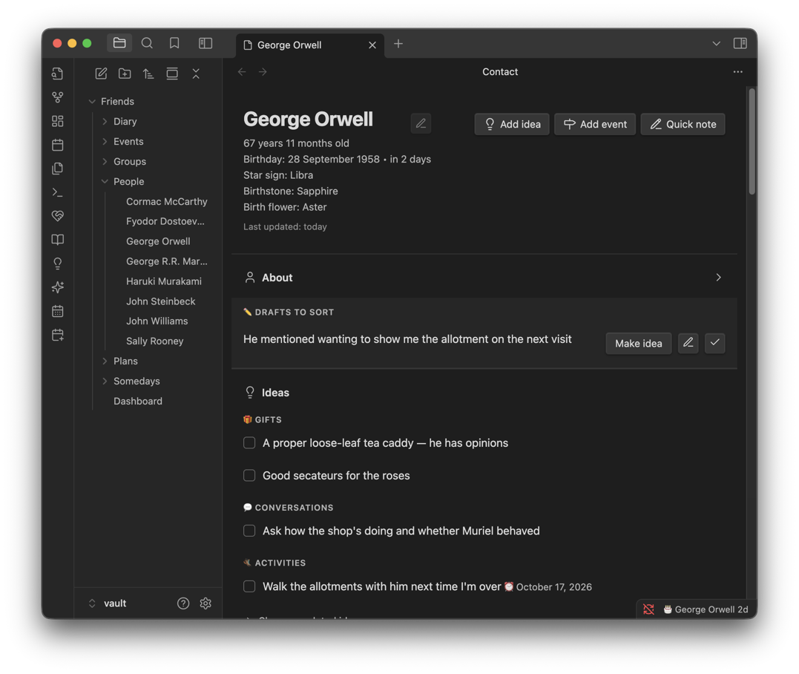
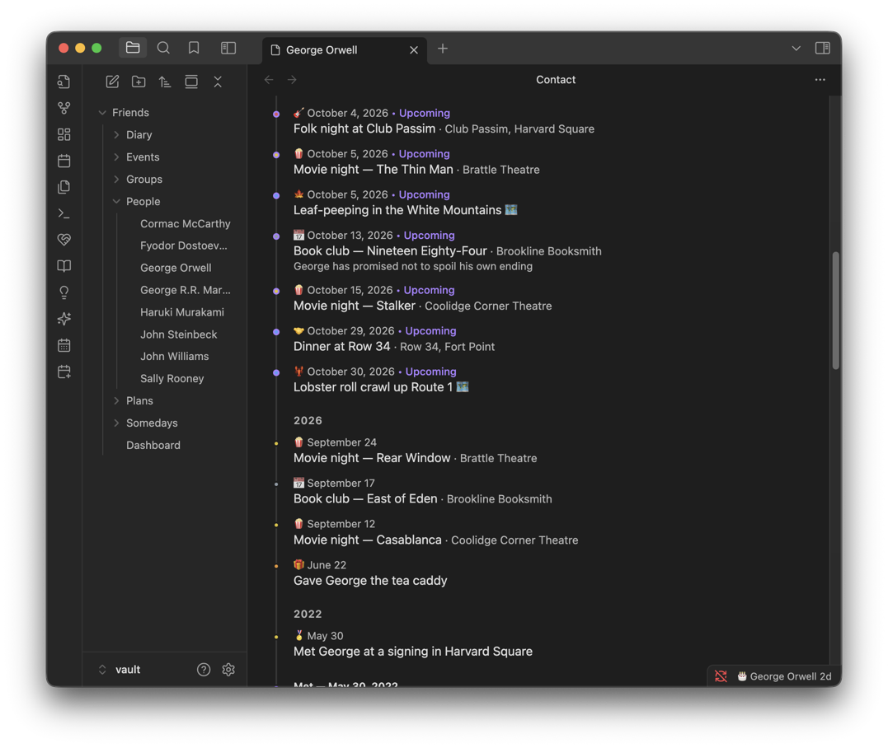
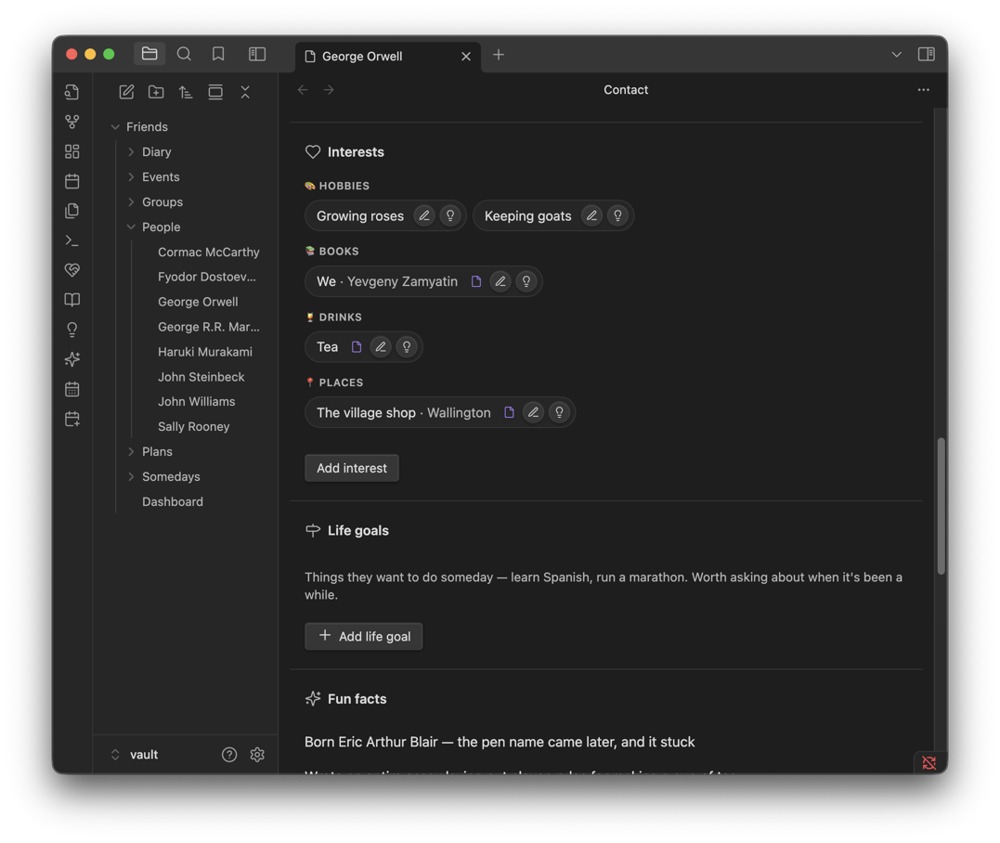
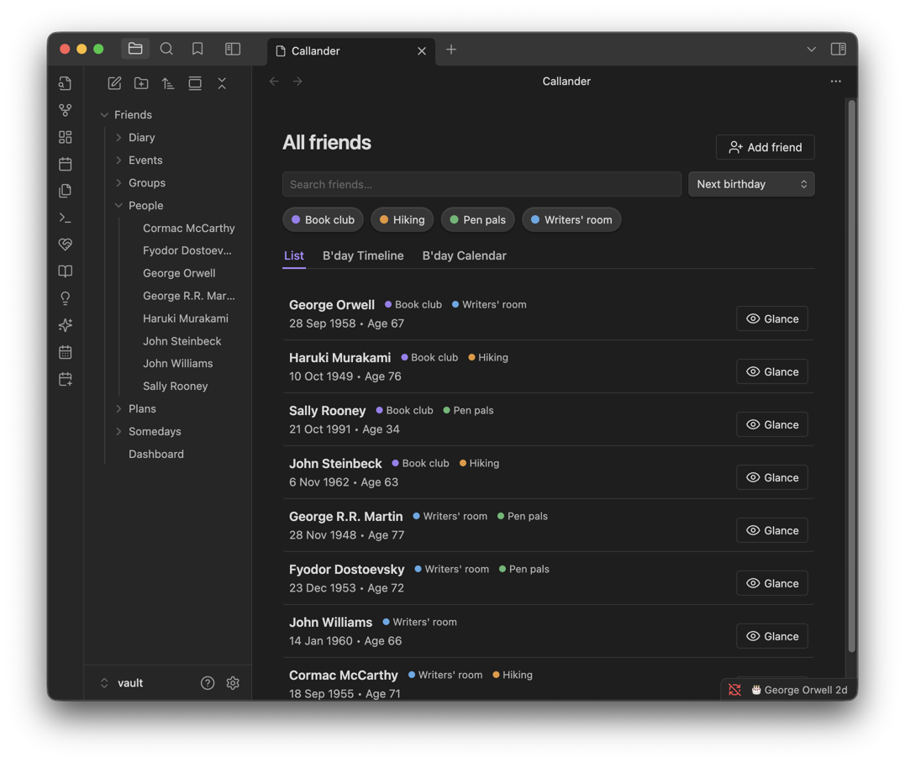
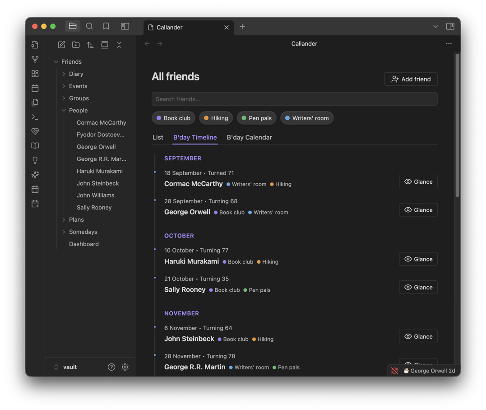
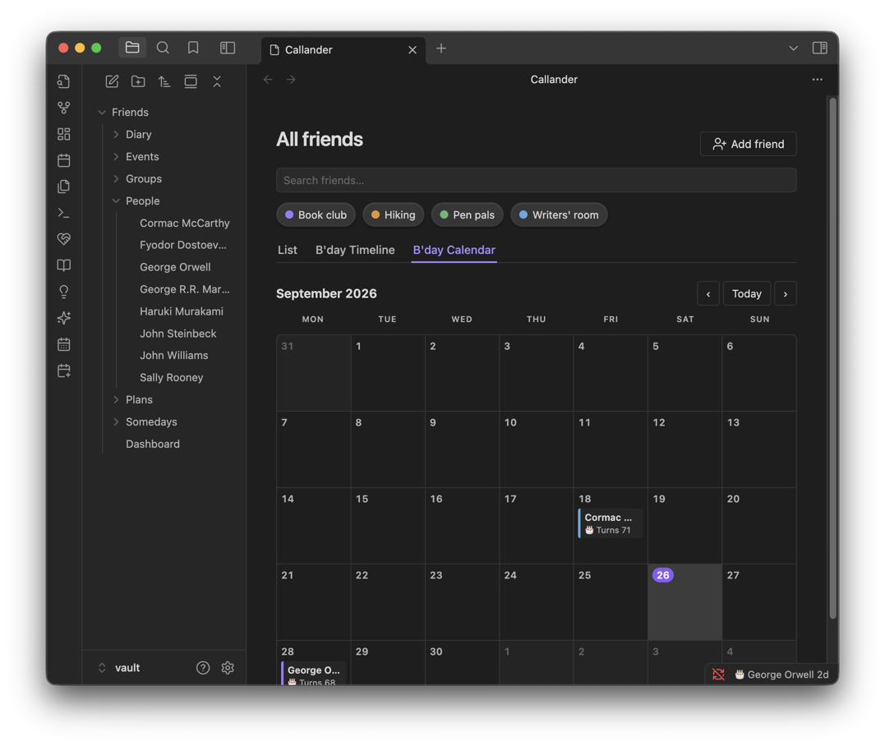
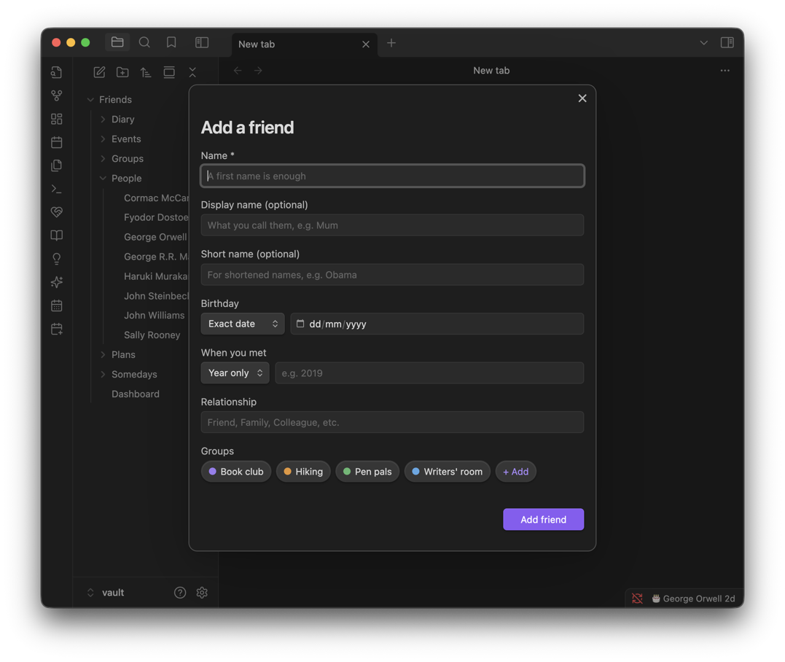
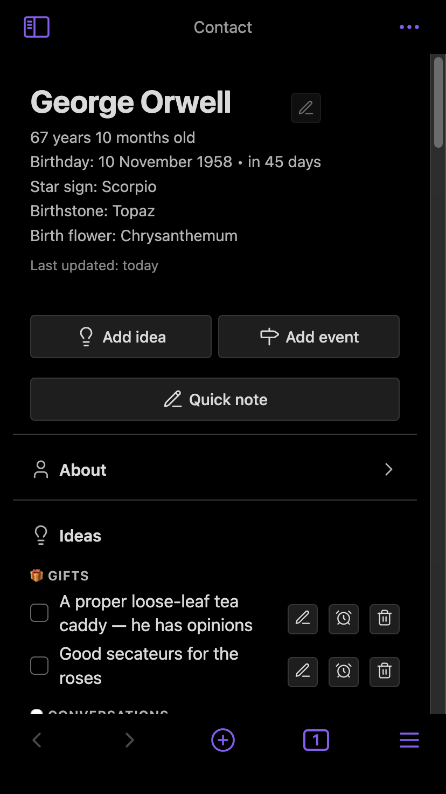

# Friends

Each friend gets a page of their own — everything you'd want in front of you before you saw them.

**Contents**

- [At a glance](#at-a-glance)
- [Adding a friend](#adding-a-friend)
- [The friend page](#the-friend-page)
- [The All friends page](#the-all-friends-page)
- [Before seeing someone: the glance](#before-seeing-someone-the-glance)
- [Birthday reminders and exports](#birthday-reminders-and-exports)
- [Birthday trivia settings](#birthday-trivia-settings)
- [Tips & hidden details](#tips--hidden-details)
- [Screenshots](#screenshots)
- [Version history](#version-history)

**See also**

- [Ideas](IDEAS.md): the ideas grouped on a friend's page, and the idea inbox
- [Groups](GROUPS.md): circles a friend can belong to
- [Quick notes](QUICK-NOTES.md): jotting something down before you've decided what it is

	
	 
	<em>Age and birthday worked out for you, and ideas grouped by kind.</em>

## At a glance

- A first name is all it takes to add someone — everything else is optional.
- Their age, next birthday, star sign, birthstone and birth flower are all worked out for you, never typed in.
- Ideas, timeline, interests, life goals, fun facts, inside jokes and quotes each have their own section, in that order.
- The All friends page shows everyone three ways: List, B'day Timeline, B'day Calendar.
- A short **glance** — who they are, open ideas, somedays — is one command away before you see someone.

## Adding a friend

Only a name is required. Everything else on the Add friend form is there for when you have it:

| Field | Notes |
| --- | --- |
| Display name | What you actually call them, e.g. "Mum" |
| Short name | How their name shortens in lists, e.g. "Cal" |
| Birthday | A full date, a month and year, or just a day and month if nobody remembers the year |
| Met | Same flexibility as birthday |
| Relationship | Free text; new ones you type are remembered for next time |
| Groups | Tick existing groups, or create one on the spot without leaving the form |

Pronouns and family links (Parents, Siblings, Children) aren't on the Add form — set those afterwards from the page's own **About** section.

## The friend page

Sections appear in this order:

1. **Header** — exact age, countdown to their next birthday, and (each its own setting) star sign, birthstone, birth flower and Chinese zodiac. **Add idea**, **Add event** and **Quick note** buttons sit below it.
2. **About** — a folded row holding the details: names, pronouns, relationship, groups, family links (Parents, Siblings, Children) and more. Whether it's open is remembered across every friend.
3. **Drafts** — anything jotted down about them and not yet filed, with **Make idea**, **Edit** and **Done**. See [Quick notes](QUICK-NOTES.md).
4. **Ideas** — grouped by what they are (gifts, conversations, things to do, books to lend). Put a date on one and it resurfaces on the dashboard when that day arrives. See [Ideas](IDEAS.md).
5. **Timeline** — one merged history: anything coming up (including trips they're part of) at the top, then a year-by-year record back to the day you met, which is itself the first entry. Diary entries that link to them are listed here too — see [Diary](DIARY.md).
6. **Interests** — short, factual things they're into. See [Ideas](IDEAS.md#interests).
7. **Life goals** — things they want to do someday. Mark one done and it stays listed under Completed.
8. **Fun facts** — trivia, click-to-edit.
9. **Inside jokes** — the shared reference next to the story of how it started.
10. **Quotes** — lines worth keeping.
11. **Notes** — free text at the bottom for anything that doesn't fit a box, with a small formatting toolbar.

## The All friends page

The same people, three ways:

| Tab | Shows |
| --- | --- |
| **List** | The plain roll-call. Narrow to a single group; sort by any of the options below. |
| **B'day Timeline** | The year ahead, month by month, with the age each person is turning. |
| **B'day Calendar** | The same year as a month grid, one square per day. |

Every row or square opens the glance (below) rather than navigating away.

**Sort options (List tab):** Next birthday · Birthday (Jan-Dec) · Birthday (Dec-Jan) · Name (A-Z) · Name (Z-A) · Newest added · Oldest added · Last event · Youngest · Oldest · Last modified.

A birthday known only to the month still counts on both birthday views — it sits in the right month and says "Unknown day," rather than being hidden or given a date nobody wrote down. Anyone with **no** birthday at all gets its own **Unknown birthdays** section at the bottom of the timeline, listed by name, because you can't fix what you can't see.

## Before seeing someone: the glance

The **Before seeing a friend (glance)** command asks who, then shows a one-screen briefing: the key facts about them, open ideas (conversations and plans first, since those matter right now), and somedays you might suggest, with a **View person** button to the full page. The same glance opens from All friends rows, the B'day Calendar, and birthdays on the [Calendar](CALENDAR.md).

## Birthday reminders and exports

- **Startup reminder.** When Obsidian opens, a notice lists today's and upcoming birthdays, once per day. The window (default 7 days) and the reminder itself are both in [Settings](SETTINGS.md#general).
- **Export birthday calendar (.ics for Apple Calendar).** Writes `Callander Birthdays.ics` to your vault root with everyone's *next* birthday, including the age they're turning where the year is known, each with an alert. Double-click it to import into Apple Calendar (pick an iCloud calendar to get phone alerts). It covers one year, so re-run and re-import yearly.
- **Generate year in friendships.** Writes `Callander Recap <year>.md` into your base folder: new friends this year, moments logged, ideas done, diary entries. Counts, not scores.

## Birthday trivia settings

Star sign, birthstone, birth flower and Chinese zodiac are each their own on/off setting — turn any of them off if you'd rather see just the date, no astrology.

## Tips & hidden details

- **A birthday known only to the month sorts as if it fell on the 1st** — worth knowing if two people share a month and you're relying on sort order to tell them apart.
- **Family links (Parents, Siblings, Children) are real wikilinks**, not free text — they show up in Obsidian's own graph view and backlinks, and offer note autocomplete as you type.
- **The B'day Calendar's number is an age, not a count** — it reads "Turns 32," specifically so it can't be misread as their current age on a day that isn't their birthday.
- **A group can be created without leaving the Add friend form** — no need to go and set one up first if you're adding several new people from the same circle at once.
- **Ideas, quotes and notes are stored as plain, readable markdown in the note body**, not buried in frontmatter — open the file directly and they read like normal prose. See [Your data](DATA.md).
- **Clicking a friend's note anywhere in Obsidian** (file explorer, quick switcher, a link, the graph) opens their Callander page. The Markdown tab still gets you to the raw note, and **Open friends in Callander view** in [Settings](SETTINGS.md#general) turns this off.

## Screenshots

	
	 
	<em>What's coming up, then the record going back to the day you met.</em>

	
	 
	<em>Interests, life goals and fun facts.</em>

	
	 
	<em>The full list, filtered to a group and sorted.</em>

	
	 
	<em>B'day Timeline: the year ahead, month by month.</em>

	
	 
	<em>B'day Calendar: the same year as a month grid.</em>

	
	 
	<em>Adding a friend: a name is enough to start.</em>

	
	 
	<em>The same friend page on a phone.</em>

## Version history

Derived from the [changelog](../CHANGELOG.md), newest first.

**1.11.0** · 2026-09-30
- Rows, birthday calendar days and page sections open from the keyboard: Tab to one, then Enter or Space.
- Dates read day first: "14 March 2019" on the Met line and birthdays.
- A friend's name is trimmed and a blank one refused. Their note's file swaps characters a file can't hold for "-", while the name stays as typed, and renaming on their page renames once, only when the name has changed.
- Their page saves only the fields you changed, and a change that syncs in while you're typing waits until you stop. It updates when their plans, groups or diary mentions change elsewhere, and no longer redraws mid-typing in a popout window.
- "Log on timeline", after ticking off an idea, logs it for the friend whose idea it was, and editing a life goal from its view keeps the notes just typed there.
- About shows fields set to 0 or false, a list field like nicknames edits as a list, and the relationship field offers its suggestions without Add friend having been opened first.
- A note with Windows line endings opens properly, and a tab restored for a friend whose note has gone says so.
- The Chinese zodiac goes by lunar year, "Met … ago" counts the day when there is one, and "Last updated" no longer says "-2 days ago".
- A 29 February birthday counts down to the right day, and shows on 1 March on the B'day Calendar and in the export in years without one.
- Any one field is enough for an interest, and the first field says what goes in it: a Song for Music, a Dish for Food, an Interest for Other.
- All friends notices deletes and renames straight away, keeps its place and what you're typing in search when it refreshes, and a group filter lets go once its group is renamed or deleted.
- The year recap links each friend's own note, counts a hangout with three friends once and leaves out cancelled events. The birthday export keeps friends with look-alike or non-Latin names apart.
- Deleting a friend takes them out of plans where they were written with an alias too.

**1.10.3** · 2026-09-26
- The eye button on an interest chip becomes a pencil, labelled Edit; a note gets its own purple hover icon.
- Interest chips are more compact, with lighter, hover/focus-aware buttons; subheadings become plural.

**1.10.2** · 2026-09-26
- Interest fields fit the type (a book's author, music's artist and genre); Song and Music Genre merge into one Music type, and a new Place type is added.
- Notes on an interest sit behind the eye button: hover to read, click to edit or delete.
- A new group can be made from the Add friend form, and groups gain a custom colour option.

**1.9.0** · 2026-09-08
- A B'day Calendar tab: the year as a month grid, one square per day.
- A Pronouns field, free text, added to the naming fields.

**1.8.0** · 2026-09-07
- A B'day Timeline tab: the year ahead in whole months, with an Unknown birthdays section for anyone the timeline can't place.
- Two more sorts, Birthday (Jan-Dec) and Birthday (Dec-Jan); the existing sort renamed Next birthday.
- A Children field, linkable like Parents and Siblings.
- The glance opens from B'day Timeline rows too.

**1.7.0** · 2026-08-19
- A Life goals section: things they want to do someday, with notes; a done goal stays listed under Completed.

**1.3.0** · 2026-08-03
- Fun facts become click-to-edit via a modal.
- Quotes and ideas move from frontmatter into plain markdown in the note body.

**1.0.1** · 2026-07-28
- Friend pages, ideas with resurfacing dates, flexible dates, and birthdays with a belated window, a daily startup digest and optional trivia.
