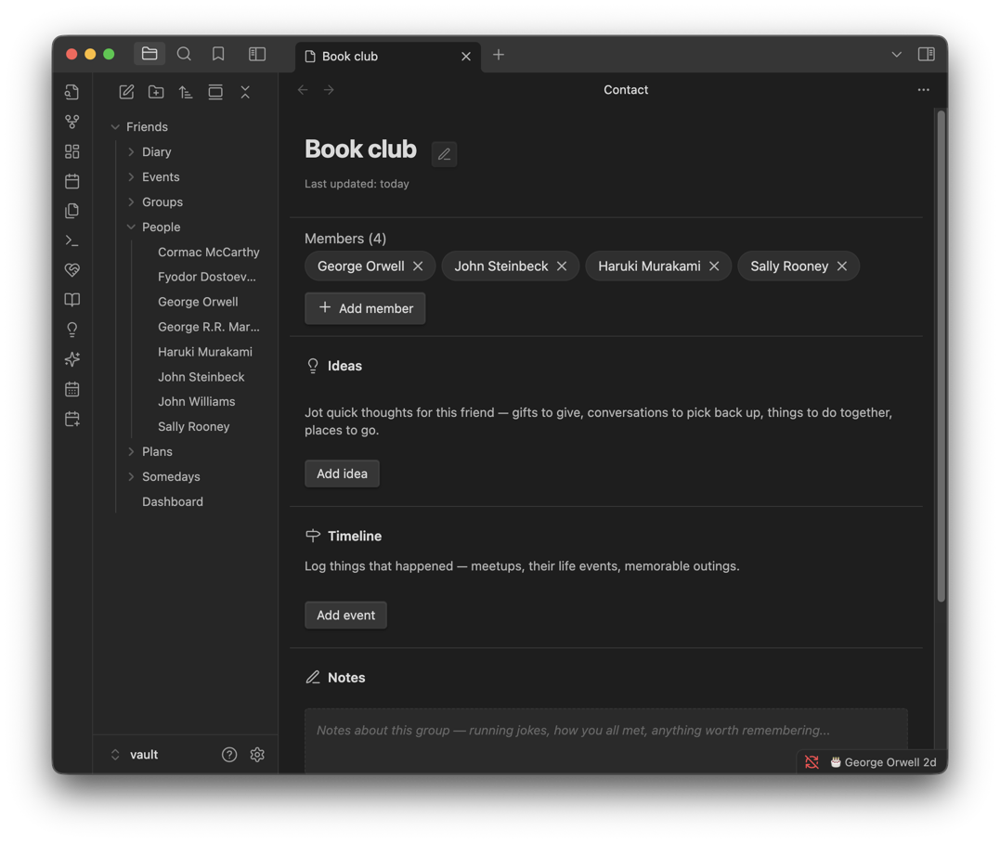

# Groups

Any circle you want to keep track of — a book club, the people you hike with, family. You don't build a group directly; you tag a person into it, and the group assembles itself from whoever's in it.

**Contents**

- [At a glance](#at-a-glance)
- [Creating a group](#creating-a-group)
- [The group page](#the-group-page)
- [Colour](#colour)
- [Tips & hidden details](#tips--hidden-details)
- [Version history](#version-history)

**See also**

- [Friends](FRIENDS.md): tagging a person into a group
- [Ideas](IDEAS.md): an idea that belongs to a whole group rather than one person

	
	 
	<em>The book club, assembled from whoever's tagged into it.</em>

## At a glance

- A group has no separate membership list to maintain — tag a person into it, and they're in.
- Each group gets its own colour, shown next to its members everywhere else.
- A group's page has the same ideas, timeline and notes a person's page has.
- Create one on the spot from the Add friend form, or from the dashboard's Groups section.

## Creating a group

- **While adding or editing a friend** — tick an existing group, or create a new one without leaving the form.
- **From the dashboard's Groups section** — **New group**, or the settings button on a group's row to rename it, recolour it or delete it.

A name and a colour are all a group needs. Renaming updates every friend tagged into it.

## The group page

The same shape as a friend's page: **Ideas** (grouped by kind, same categories a person's ideas use), a **Timeline**, and free-text **Notes**. That means an idea can belong to the whole circle rather than one individual — a bar to try with everyone, or a trip to float at the next meet-up — rather than having to pick one member to hang it on.

## Colour

Pick one of nine swatches, or a custom colour with the colour picker. A group's colour shows up:

- Next to its name wherever it's listed (the dashboard's Groups section, a person's group chips).
- As the group's colour on the Calendar, when **Color by group** is on — see [Calendar](CALENDAR.md#the-drawer).

## Tips & hidden details

- **A group exists the moment someone's tagged into it** — there's no separate "create the group first" step required if you'd rather just start tagging people and clean up names later.
- **A group can be named on an event or plan** in place of listing everyone, so the event shows on the group's own timeline.
- **Punctuation in a name is fine.** A group like `Sci-Fi [Book Club]` links correctly everywhere it's used.
- **Friend search on the dashboard matches group names**, so typing a group's name lists everyone in it.
- **A group made from the Add friend form is create-only there** — rename or recolour it afterwards from the dashboard's Groups section.
- **Membership is stored on the person, as a wikilink to the group**, so it shows in Obsidian's graph and backlinks. See [Your data](DATA.md).

## Version history

Derived from the [changelog](../CHANGELOG.md), newest first.

**1.10.2** · 2026-09-26
- A new group can be made from the Add friend form, and groups gain a custom colour option.

**1.10.0** · 2026-09-21
- Fixed: a group name containing a bracket or similar punctuation no longer breaks its wikilink, which could silently drop it off a plan it was added to.

**1.7.1** · 2026-08-20
- Fixed: a group named on an event (rather than a person) could silently vanish from it on save; groups now render with the correct colour and capitalisation everywhere they're shown.
