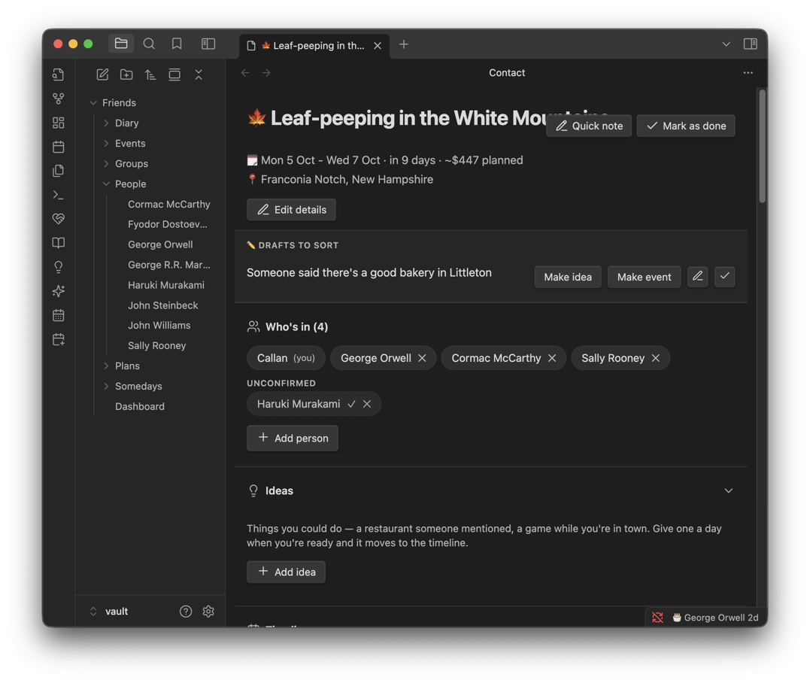
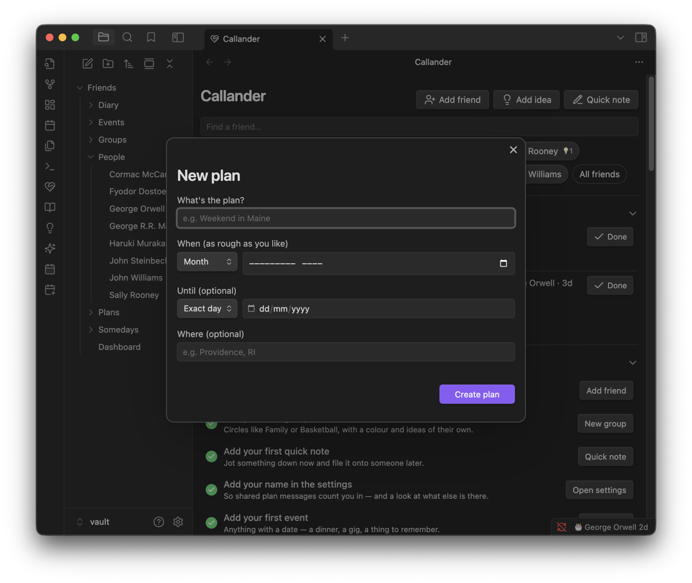
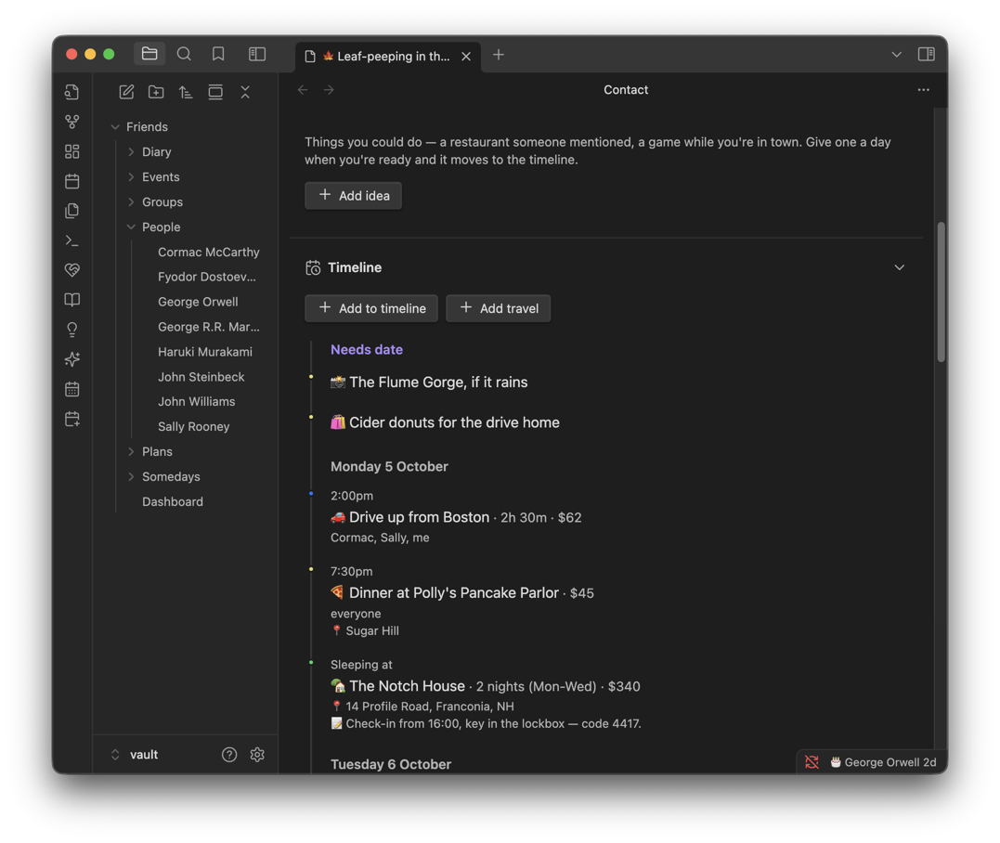
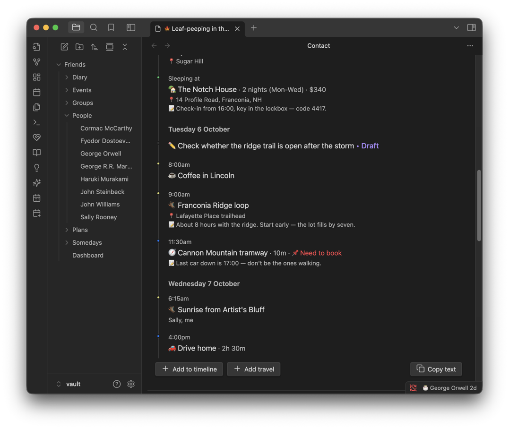
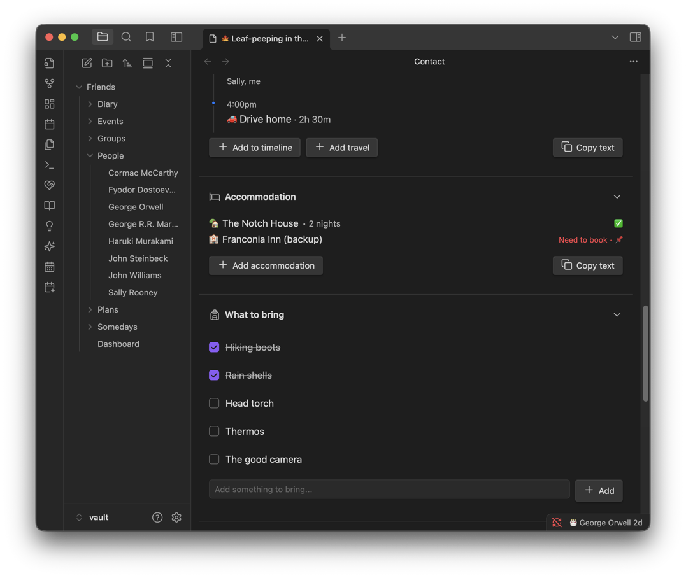
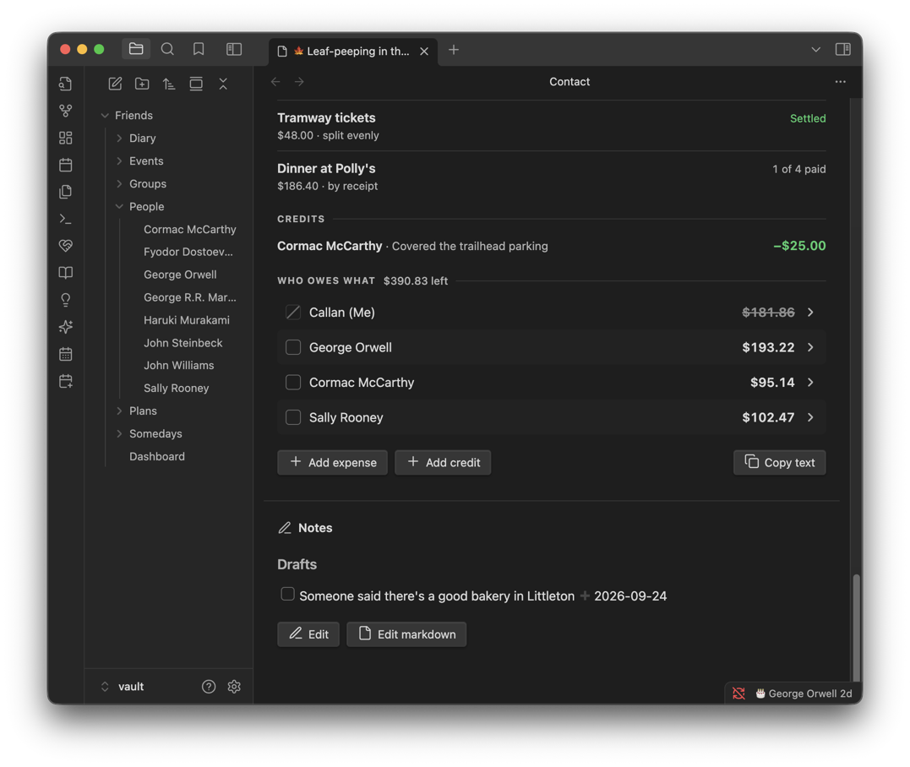
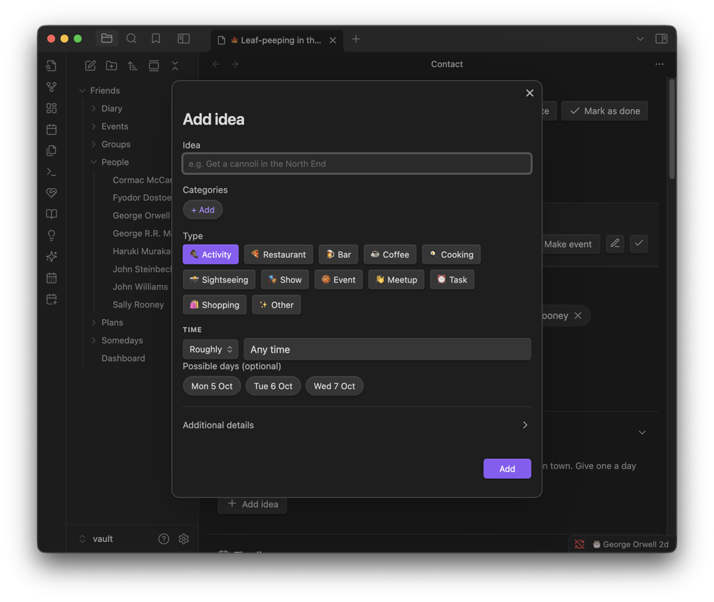
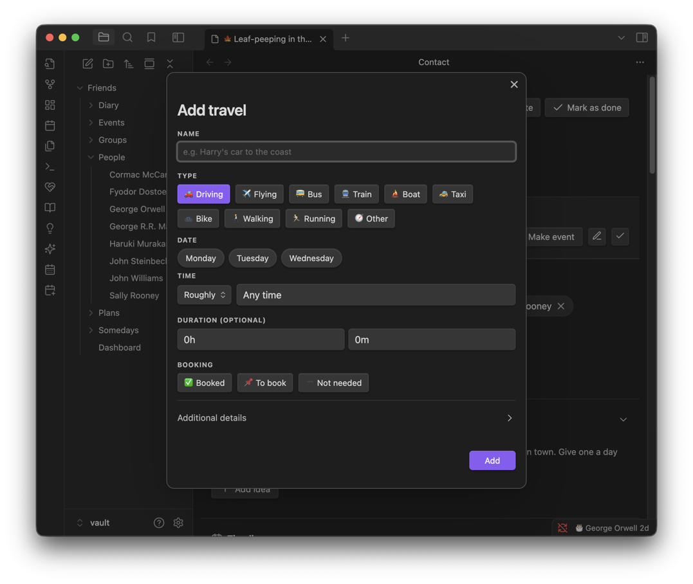
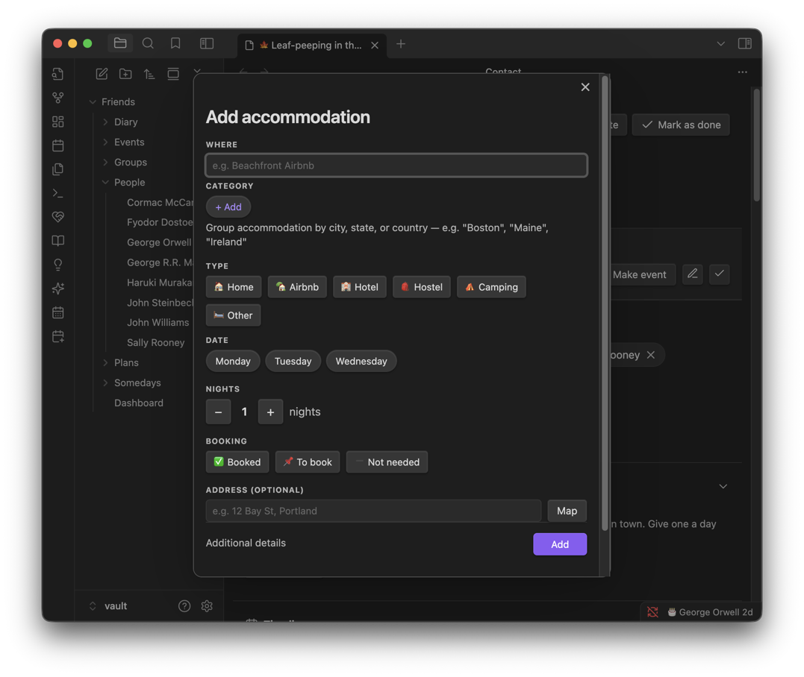
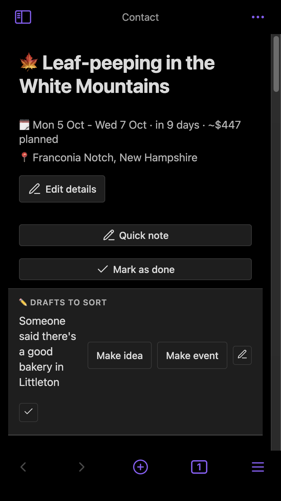

# Plans

A plan is for the bigger things: a weekend away, several people, an itinerary, a packing list and shared money. Each plan is a note in `Friends/Plans/`, opened as its own page.

**Contents**

- [At a glance](#at-a-glance)
- [Creating a plan](#creating-a-plan)
- [The plan page](#the-plan-page)
- [Times: exact or rough](#times-exact-or-rough)
- [The Plans page](#the-plans-page)
- [Where plans show up](#where-plans-show-up)
- [Tips & hidden details](#tips--hidden-details)
- [Screenshots](#screenshots)
- [Version history](#version-history)

**See also**

- [Expenses](EXPENSES.md): the cost breakdown, splitting and settling up
- [Somedays](SOMEDAYS.md): ideas that haven't become a plan yet
- [Calendar](CALENDAR.md): plans shown alongside events and birthdays

	
	 
	<em>A plan's header and who's coming, including people who haven't confirmed.</em>

## At a glance

- Start a plan with just a name and a rough date. A month on its own is fine.
- Everything dated (things to do, journeys, where you're staying) forms one running order for the trip.
- People who haven't confirmed are tracked separately, and don't count towards costs.
- Costs are split per expense and roll up to one "who owes what" figure per person.
- Sections can be copied as plain text for a group chat.

## Creating a plan

| From | How |
| --- | --- |
| Dashboard | **New plan** in the Plans section |
| Plans page | **New plan** |
| An event | Open the event, then **Make plan**. The new plan takes the event's name, date, people and place, and the event becomes its first timeline item. |
| A someday | Open the someday, then grow it into a plan. |

The date can be as precise as you know it: a day, a range of days, a month, or nothing yet.

## The plan page

Sections appear top to bottom in this order. Long sections have a chevron to fold them. **What you fold stays folded on every plan**, not just the one you're on.

### Header

Name, dates, how far away it is, the estimated total, and the location (which opens in Maps). **Edit details**, **Quick note** and **Mark as done** sit below it; a done plan offers **Reopen plan** instead.

### Drafts to sort

Loose thoughts about the trip. Each has **Make idea**, **Make event**, **Edit** and **Done**.

- A draft **without** a day sits here at the top of the plan.
- A draft **with** a day leads that day in the Timeline instead.

### Who's in

The heading shows the head count.

- **Members** are going and share costs.
- **Unconfirmed** people are listed separately. They're left out of every split until you move them into Members.
- A group can be added as well as a person.

### Ideas

The menu of things you might do on the trip, each with a category and a priority (🎯 Must-do or 🤔 Maybe). Give an idea a day and it also appears on the Timeline.

Built-in categories: 🥾 Activity · 🍕 Restaurant · 🍺 Bar · ☕ Coffee · 🍳 Cooking · 📸 Sightseeing · 🎭 Show · 🏀 Event · 👋 Meetup · ⏰ Task · 🛍️ Shopping · ✨ Other

### Timeline

The running order: dated ideas, travel and accommodation, grouped by day and sorted by time. **Add travel** lives here, since a journey only makes sense on a day.

- Journeys show their length, cost and who's in the car.
- Where you're staying shows on the check-in day, with the address and door code on the row.
- Anything not booked yet is flagged **Need to book**.
- Hover an empty day to get quick-add buttons, already dated to that day.

**Travel.** Each journey records how you're getting there, when, how long it takes, the cost, who's travelling and whether it's booked. Modes: 🚗 Driving · ✈️ Flying · 🚌 Bus · 🚆 Train · ⛵ Boat · 🚕 Taxi · 🚲 Bike · 🚶 Walking · 🏃 Running · 🧭 Other

### Accommodation

Every place you might stay, **including backups you haven't committed to** — leave a backup undated or marked To book until you decide. Listed in check-in order, with undated stays last.

- Types: Home, Airbnb, Hotel, Hostel, Camping, Other.
- Booking status: ✅ Booked, 📌 To book, ➖ Not needed.
- Check-in and check-out take an hour, or **Any time** (which is different from leaving it blank).

### What to bring

A shared packing list anyone can tick off.

### Cost breakdown

Expenses, credits and who owes what. See [Expenses](EXPENSES.md).

### Notes

Free text for booking confirmations, links, and anything else that doesn't fit a field. **Edit markdown** opens the underlying note.

## Times: exact or rough

Anything on the Timeline can have an exact time, or a rough one that still sorts correctly:

| Rough time | Sorts as |
| --- | --- |
| Early morning | 07:00 |
| Breakfast | 09:00 |
| Morning | 10:30 |
| Lunchtime | 12:30 |
| Afternoon | 14:00 |
| Late afternoon | 16:30 |
| Dinner time | 19:00 |
| Late night | 21:30 |

## The Plans page

Every plan, past and future. Open it from the dashboard's Plans section or the **Open plans** command.

- **Upcoming / Past / All**, shown as a **Timeline** or a **List**.
- Filter by status and by who's going. Search matches names.
- A trip counts as upcoming until its **last** day has passed, so one that's underway doesn't drop into Past.
- Plans you've hidden from the dashboard or the Events page still show here.

## Where plans show up

| Place | Behaviour |
| --- | --- |
| Dashboard → Plans | Upcoming plans. |
| Dashboard → Upcoming | Among events, by date. Tap one for a quick overview with a link to the full plan. |
| Events page | On the list, timeline and calendar. A multi-day plan draws as one bar across its days. |
| Calendar page | Alongside events and birthdays. Can be toggled off in the drawer. |
| A person's page | Under their timeline, for any plan they're a member of. |

## Tips & hidden details

- **Hide a plan from the dashboard's Upcoming only.** Tap it in Upcoming and choose **Hide from this list**. It stays everywhere else. Put it back with **Show in Upcoming** on its row in the Plans section.
- **Turn plans off in Upcoming altogether** from Upcoming's ⚙ settings.
- **Categories are saved on the plan.** A category you stop using stays offered for next time.
- **Remove a category by long-pressing its chip for two seconds.** It's removed from the plan and from every idea carrying it, so it asks first.
- **Accommodation has its own categories**, separate from the ideas' ones. Useful for a trip with stays in several towns.
- **A run of consecutive possible days collapses to a range**, e.g. `Sun 2 Aug - Wed 5 Aug`.
- **Copy as text.** The Timeline, Cost breakdown, a single expense, one person's ledger, Accommodation and Ideas can each be copied as plain text. The toggles offered only include the ones that change something, and there's no emoji, so it pastes cleanly into a chat.
- **Costs copy as a chase-up.** Your own share and anything already settled are left out, so the copy is just what's still owed.
- **Add to calendar.** Any timeline item (idea, travel or accommodation) can open a prefilled Google Calendar entry.
- **Deleting a friend removes them from every plan's Who's in**, rather than leaving a dead name behind.

## Screenshots

	
	 
	<em>Starting a plan: a name and a date as rough as you like.</em>

	
	 
	<em>The Timeline: journeys, meals and where you're staying in one running order.</em>

	
	 
	<em>Later days, and every place you might stay.</em>

	
	 
	<em>What to bring, and the cost breakdown.</em>

	
	 
	<em>Notes at the bottom of the page.</em>

	
	 
	<em>Adding an idea, with a category, a day and an exact or rough time.</em>

	
	 
	<em>Adding a journey: how you're travelling, how long it takes, and whether it's booked.</em>

	
	 
	<em>Adding somewhere to stay: the kind of place, the nights, and an address that opens in Maps.</em>

	
	 
	<em>The same plan on a phone.</em>

## Version history

Derived from the [changelog](../CHANGELOG.md), newest first.

**1.10.2** · 2026-09-26
- A Plans page, with search, Upcoming / Past / All, Timeline or List, and status and people filters.
- Drafts on a plan gain Make idea, Make event, Edit and Done. Undated ones are kept in a `## Drafts` checklist in the plan's note, and a dated one leads its day on the Timeline.
- Deleting a friend removes them from every plan's Who's in.

**1.10.0** · 2026-09-21
- Plans show on the Events page's list, timeline and calendar, and on the new Calendar page. A multi-day plan draws as one bar.
- **Make plan** on an event seeds a new plan from it.
- Upcoming's settings can turn plans on or off.

**1.9.2** · 2026-09-15
- Longer sections fold, and stay folded across every plan.
- Copy as text for the Cost breakdown, a single expense, a person's ledger, Accommodation and Ideas.
- Accommodation reads in check-in order, and takes a category.
- Plans appear in the dashboard's Upcoming, with **Hide from this list**.

**1.9.1** · 2026-09-09
- The cost breakdown becomes a settle-up ledger. See [Expenses](EXPENSES.md).

**1.7.0** · 2026-08-19
- Empty Timeline days offer quick-add buttons on hover.

**1.6.0** · 2026-08-18
- Idea categories become toggle chips saved on the plan. Long-press to remove one.
- Possible days become toggle pills, and consecutive days collapse to a range.
- Duration becomes an hours and minutes picker.
- Accommodation check-in and check-out times, and a redesigned row.
- **Add to calendar** on timeline items.
- "Mate's" accommodation merges into "Home".

**1.4.0** · 2026-08-10
- Plan quick notes can carry a date, and appear on the Timeline.
- Time offers "Any time" and "All day".
- "Additional details" section on the idea, travel and accommodation forms.

**1.3.0** · 2026-08-03
- Travel and accommodation can be marked Booked.
- New view modals for timeline items.
- Stay summaries read as "3 nights (Thu–Sun)".
- Travel adds Bike, Walking and Running.
- Copy as text uses first names only.

**1.0.1** · 2026-07-28
- Plans introduced: ideas, travel, accommodation, packing list and cost splitting.
