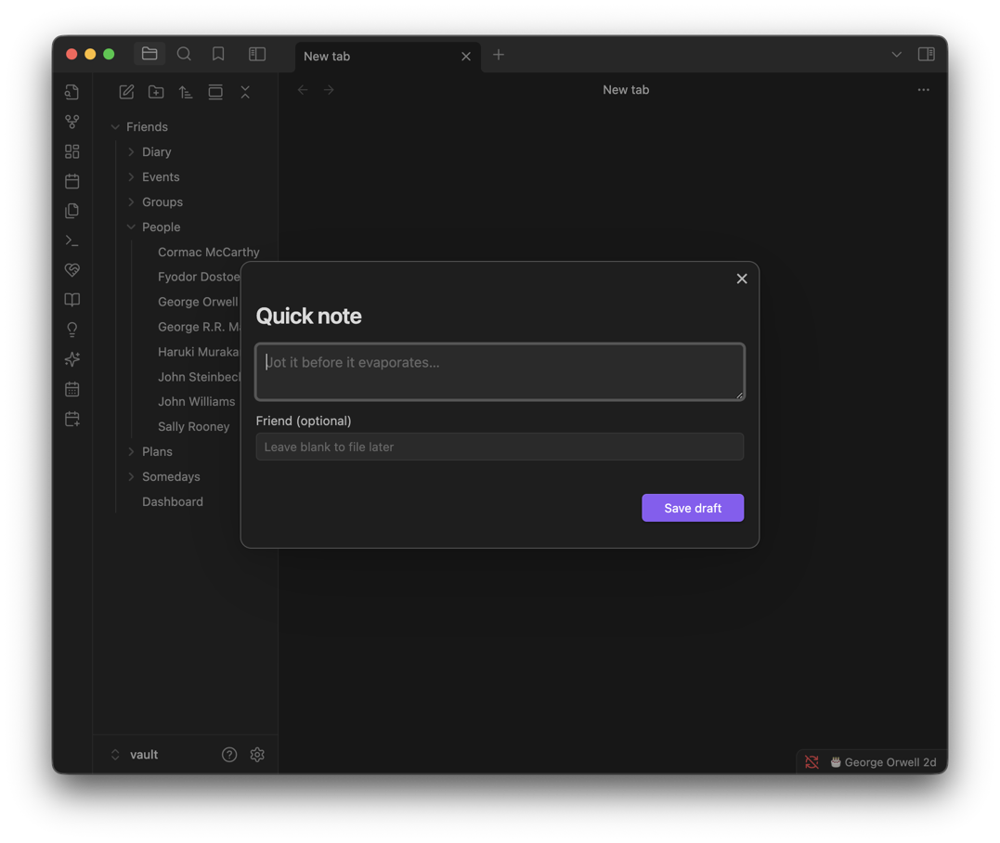

# Quick notes

The smallest thing in Callander, and possibly the most useful: type a thought, optionally say who it's about, save. Nothing to categorise yet.

**Contents**

- [At a glance](#at-a-glance)
- [Capturing one](#capturing-one)
- [Where drafts show up](#where-drafts-show-up)
- [On disk](#on-disk)
- [Tips & hidden details](#tips--hidden-details)
- [Version history](#version-history)

**See also**

- [Ideas](IDEAS.md): what a draft becomes once you decide what it is
- [Dashboard](DASHBOARD.md): the Drafts section
- [Plans](PLANS.md): a plan's own drafts

<p align="center">
	
	<br />
	<em>Type the thought, optionally say who it's about, save.</em>
</p>

## At a glance

- No category, no friend required — write the thought, decide later.
- Lands as a checklist item, not a separate note: **Done** ticks it off rather than deleting it, so it stays a record of what you jotted down.
- Turning a draft into an idea or event leaves the draft in place until you tick it off yourself.
- Stored in a format the community **Tasks** plugin also understands.

## Capturing one

- **Quick note** button on the dashboard header, or the **Quick note (draft)** command.
- On a friend's own page, the **Quick note** button under their name.
- On a plan's page, as a dated or undated draft on its Timeline.

Naming a friend links the draft to them; leaving it blank keeps it in the dashboard's own general list.

## Where drafts show up

| Where | Behaviour |
| --- | --- |
| Dashboard's Drafts section | Every open draft, newest first, whoever it's about |
| A person's own page | Only drafts about them |
| A plan's page | The plan's own drafts, separate from the dashboard's |

What each row offers depends on where it is:

| Where | Actions |
| --- | --- |
| Dashboard | **View person** (if it's about someone), **Make idea**, **Add event**, **Edit**, **Done**. Edit can also change who it's about. On a phone the buttons shrink to icons. |
| A person's page | **Make idea**, **Edit**, **Done** |
| A plan's page | **Make idea**, **Make event**, **Edit**, **Done** |

## On disk

Kept as a checklist under a `## Drafts` heading in the dashboard note (or a plan's own note), not as frontmatter — a handled draft is *ticked*, not deleted, so the file doubles as a record of everything you've ever jotted down:

```
## Drafts

- [ ] Ask about the allotment [[George Orwell]] ➕ 2026-09-15
- [x] Book the dentist ➕ 2026-09-10 ✅ 2026-09-21
```

The `➕`/`✅` markers are the **Tasks** community plugin's own convention for created/done dates — so a vault that also runs Tasks reads and queries these the same way it would its own to-dos. A named friend is a real `[[wikilink]]`, so it shows in their backlinks and survives a rename.

## Tips & hidden details

- **A draft you file as an idea or event isn't removed** — it stays on the list until you separately tick it Done, since filing it is only one of the things you might still want to do with the same thought.
- **The markers double as a query surface.** If you use the Tasks plugin elsewhere in your vault, a `➕ 2026-09-15` on a draft is something Tasks' own queries can already find, with no extra setup.
- **A friend link on a draft is a real backlink**, so it shows up in that person's own backlinks pane in Obsidian, not just inside Callander.

## Version history

Derived from the [changelog](../CHANGELOG.md), newest first.

**1.11.0** · 2026-09-30
- A plan's drafts stay above its Notes. Reopening a plan could move them inside Notes, where an ordinary edit to the notes would delete them; a plan already affected has them moved back when it's opened.
- Emptying a plan draft's text no longer makes later edits land on the next draft. An emptied draft keeps what it last said; Discard is how one goes.
- Discarding, converting or deleting a plan's dated draft acts on that draft, not a neighbour, when an earlier draft has no text.
- Make idea on a plan's draft opens the Add form, with the plan's days and people to pick from, rather than an edit of an idea that didn't exist yet.
- Filing a draft as an idea, or editing a plan's draft, marks the note updated, and notes typed into a draft that can't be saved as it closes say so.

**1.10.3** · 2026-09-26
- A draft's View person, Make idea and Add event gain icons; on a phone the labels drop to fit the row.

**1.10.2** · 2026-09-26
- Quick notes and drafts move into a `## Drafts` checklist (from frontmatter), with a link to the person and Done ticking rather than deleting.
- A draft's Edit can reassign who it's about.

**1.4.0** · 2026-08-10
- Quick notes on a Plan can carry a date, appearing on its Timeline as a purple draft.
