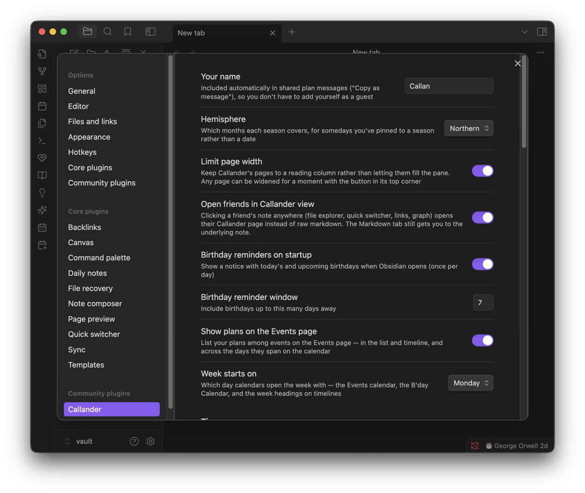
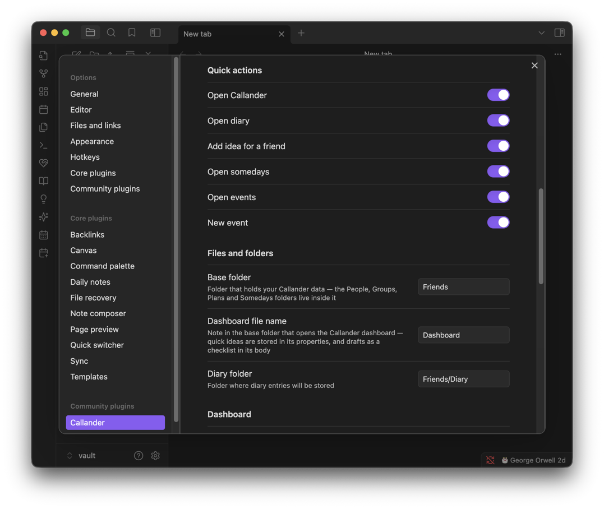

# Plugin settings

Every setting in Callander's own settings tab, grouped the way the tab itself groups them.

**Contents**

- [General](#general)
- [Timezone](#timezone)
- [Quick actions](#quick-actions)
- [Files and folders](#files-and-folders)
- [Dashboard sections](#dashboard-sections)
- [Dashboard](#dashboard)
- [Friends](#friends)
- [Cost breakdown](#cost-breakdown)
- [Experimental](#experimental)
- [Tips & hidden details](#tips--hidden-details)
- [Screenshots](#screenshots)

**See also**

- [Dashboard](DASHBOARD.md): section order and friend suggestions in practice
- [Expenses](EXPENSES.md): what the Cost breakdown settings change
- [Somedays](SOMEDAYS.md): where Hemisphere is used

	
	 
	<em>General settings at the top of the tab.</em>

## General

| Setting | Default | Does |
| --- | --- | --- |
| Your name | *(blank)* | Included automatically in shared plan messages ("Copy as message"), so you don't have to add yourself as a guest |
| Hemisphere | Northern | Which months each season covers, for a someday pinned to a season rather than a date |
| Week starts on | Monday | Drives the Events calendar, the B'day Calendar, and every "This week"/"Last week" heading |
| Show plans on the Events page | on | List plans among events on the Events page — list, timeline, and across the days they span on the calendar |
| Limit page width | on | Keeps pages to a reading column rather than filling the pane; any page can be widened for the session with the button in its top corner |
| Open friends in Callander view | on | Clicking a friend's note anywhere (file explorer, quick switcher, links, graph) opens their Callander page instead of raw markdown. The Markdown tab still reaches the underlying note |
| Birthday reminders on startup | on | A notice with today's and upcoming birthdays when Obsidian opens (once per day) |
| Birthday reminder window | 7 days | Include birthdays up to this many days away in that notice |

## Timezone

| Setting | Does |
| --- | --- |
| Plugin timezone | Locks the whole plugin to one specific timezone, overriding your device's own. **Not recommended for most users** — only useful if you actually use timezones on events *and* you're briefly somewhere else and want everything to keep reading in your usual zone rather than the one you're in |

## Quick actions

Toggle which ribbon icons appear, one per action: **Open Callander** (on by default), **Open diary**, **Add idea**, **Open somedays**, **Open events** and **New event** (all off by default). Turning one off removes it from the ribbon entirely, including the ribbon menu on a phone.

## Files and folders

| Setting | Default | Does |
| --- | --- | --- |
| Base folder | `Friends` | Holds your Callander data — the People, Groups, Events, Plans and Somedays folders live inside it |
| Dashboard file name | `Dashboard` | The note in the base folder that opens the dashboard; quick ideas live in its properties, drafts as a checklist in its body |
| Diary folder | `Friends/Diary` | Where diary entries are stored |

## Dashboard sections

Drag to reorder — **Obsidian 1.13 and later only**; on older versions the dashboard keeps its shipped order and this control doesn't appear at all. A section a future update adds slots in where it ships, rather than always landing at the bottom of your custom order.

## Dashboard

| Setting | Default | Does |
| --- | --- | --- |
| Show getting started | on | The onboarding checklist — see [Dashboard](DASHBOARD.md#sections) |
| Belated birthday window | 14 days | How long "birthday was X days ago" keeps showing, so there's still time for a belated message |
| Somedays shown | 10 | How many somedays list before the rest fold into a "+N more" link |
| Friend suggestions shown | 9 | How many recently-touched friends the dashboard suggests under the search bar |

## Friends

Four toggles, each showing or hiding one piece of birthday trivia on a friend's page: **Show star sign**, **Show birthstone**, **Show birth flower**, **Show Chinese zodiac**.

## Cost breakdown

| Setting | Default | Does |
| --- | --- | --- |
| Sales tax | on | Offers "Add sales tax?" on a by-receipt expense split. Turn off if bills where you live already include it |
| Default sales tax | 6.25% | Pre-filled when you tick "Add sales tax?" |
| Tip | on | Offers "Add tip?" on a by-receipt expense split. Turn off if tipping isn't done where you live |
| Default tip | 20% | Pre-filled when you tick "Add tip?" |

See [Expenses](EXPENSES.md#tax-and-tip) for how these apply once ticked.

## Experimental

| Setting | Does |
| --- | --- |
| Native editor for notes | Writes Notes on Person, Group and Plan pages in Obsidian's own editor — live preview, your hotkeys, other plugins' editor features — instead of the standard Notes box. **Uses non-public Obsidian APIs**, which could break without notice in a future Obsidian version; if it does, the standard Notes box is shown instead — turn this off if anything looks wrong |

## Tips & hidden details

- **Turning off "Sales tax" or "Tip" doesn't remove either from an expense that already has one** — it only stops the option being *offered* on a new split, so nothing already recorded silently disappears.
- **"Open friends in Callander view" doesn't lock you out of raw markdown** — the Markdown tab on the same note is always still there.
- **The Dashboard sections drag-to-reorder control only exists on Obsidian 1.13+.** If you don't see it, that's why — the dashboard still works, just in its shipped order.
- **Plugin timezone is explicitly a rare-case setting**, not a "set this to your home timezone" field — leave it unset unless you specifically need every time pinned regardless of where you (or your device) currently are.
- **The native notes editor is opt-in and reversible** — nothing is lost if it stops working in a future Obsidian release; the plugin just falls back to its own Notes box.

## Screenshots

	
	 
	<em>Quick action toggles, and files and folders.</em>

