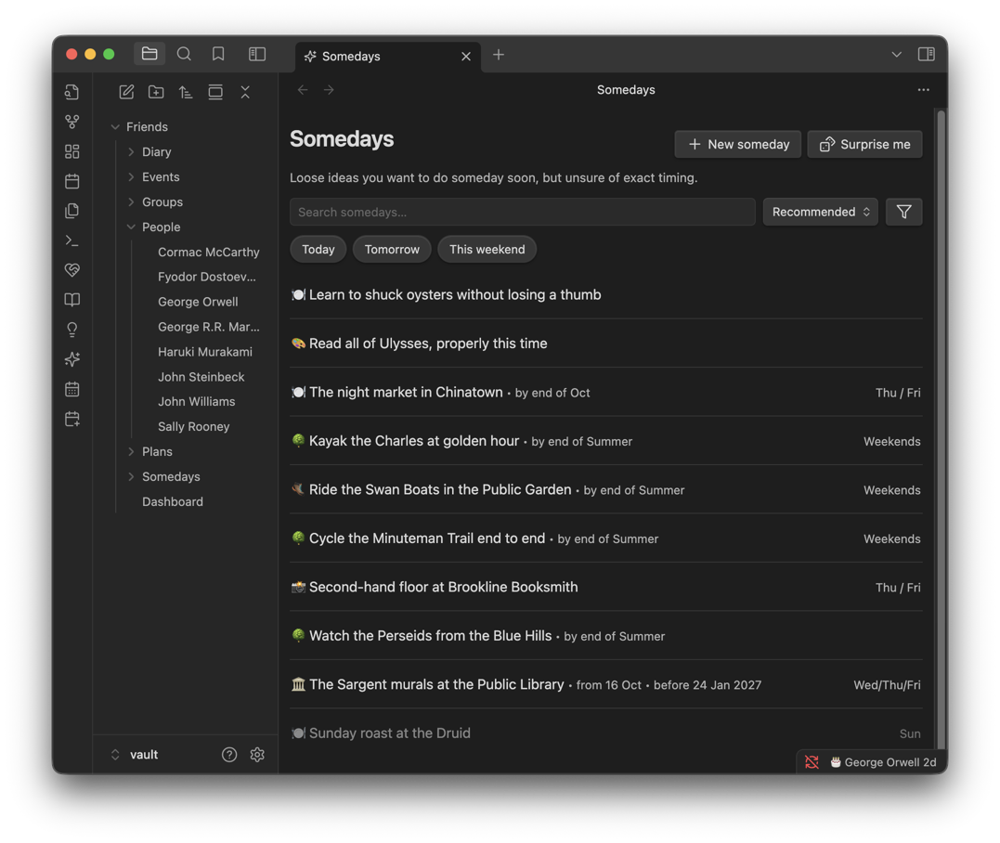
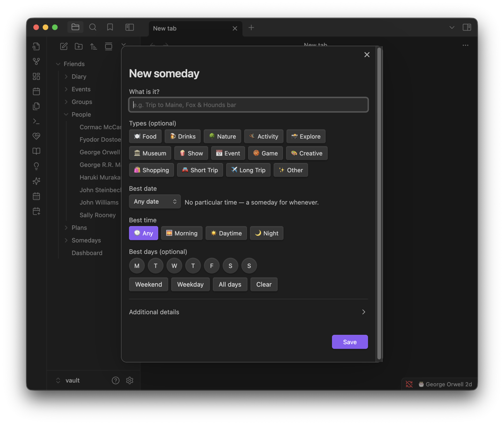
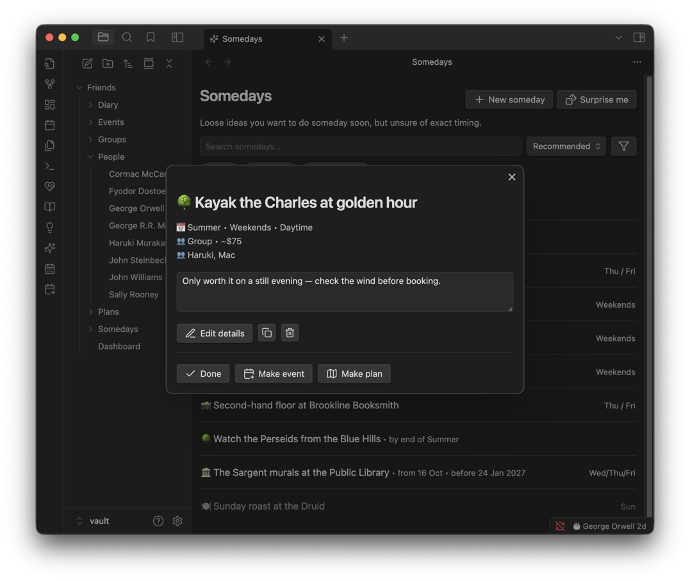

# Somedays

The things you'd like to do but haven't committed to — the exhibition you keep meaning to catch, the trail you've never cycled, the book you'll get to eventually. Deliberately lighter than a plan: no date to agree on, nobody to invite, no money to split.

**Contents**

- [At a glance](#at-a-glance)
- [Adding a someday](#adding-a-someday)
- [When it fits](#when-it-fits)
- [Sorting and quick filters](#sorting-and-quick-filters)
- [Opening one](#opening-one)
- [Tips & hidden details](#tips--hidden-details)
- [Screenshots](#screenshots)
- [Version history](#version-history)

**See also**

- [Plans](PLANS.md): growing a someday into a full trip
- [Events](EVENTS.md): turning a someday into a single dated event
- [Dashboard](DASHBOARD.md): the Somedays section

	
	 
	<em>Loose ideas, sorted by what fits best right now.</em>

## At a glance

- Just the idea, plus whatever you happen to know about when it would work — nothing is required.
- Sorts itself by what's actually doable given today's date and season, or shuffle with a surprise-me button.
- **Today**, **Tomorrow** and **This weekend** filters answer "what could I do right now," not "what do I want to do one day."
- One tap turns it into a dated event, or grows it into a full plan with people and a budget — never retyped.

## Adding a someday

A name is all that's required. Everything else narrows *when* it fits:

| Field | What it captures |
| --- | --- |
| Season | Spring, Summer, Fall or Winter |
| Days | Which weekdays suit it (toggle any combination) |
| Time of day | Morning, Daytime, Night — all three ticked shows as a single "Any" |
| Window | A "from" date it opens (tickets on sale, a show starts) and an "until" date it closes (the season ends, the run finishes) — unlike the date below, this isn't when you *hope* to do it, it's when the chance is gone |
| Date | A specific day, month, or year, as an alternative to a season |
| Type | One or more of Food, Drinks, Nature, Activity, Explore, Museum, Show, Event, Game, Creative, Shopping, Short Trip, Long Trip, Other |
| People | Friends you'd suggest it to |
| Cost | An estimate |
| Notes | Anything else |

## When it fits

Every "does this fit today?" answer runs the same test:

- If you've picked specific **days**, today has to be one of them.
- If there's a **window**, today has to be inside it — not yet open or already closed both count as no.
- If you've picked a **season**, today's season (by your **Hemisphere** setting — see [Settings](SETTINGS.md)) has to be one of them.
- Otherwise, a specific **date** has to match down to whatever precision you gave it.

Something with none of the above is possible any time.

## Sorting and quick filters

Sort by **Recommended**, **Newest**, **Oldest**, **Type**, **Random**, **Name (A-Z)** or **Name (Z-A)**.

**Recommended** favours what's actually live: a someday not yet open sinks below everything that's doable now, one about to close (within 30 days) rises, and a long trip sinks slightly below a short one when you're asking "what should we do this weekend."

**Today**, **Tomorrow** and **This weekend** each run the same fitness test against a different day, so the filter always answers what's genuinely possible then — not just what's tagged with a matching word. "This weekend" means the coming Saturday and Sunday specifically.

**Surprise me** (🎲) opens a random open someday — anything not done and not already turned into a plan.

## Opening one

Three buttons matter:

| Button | What happens |
| --- | --- |
| **Mark done** | Archives it as something you did. Tap again to reopen. |
| **Make event** | Opens a new event prefilled with its name, date (or the window's opening day) and people. Optionally marks the someday done once saved. |
| **Make plan** | Opens a new plan prefilled with its name and date. Once created, any sub-ideas it carries from older versions become the plan's ideas (as Maybe), suggested people become members, and the fuzzy details (type, timeframe, days, budget, notes) are written into the plan's notes as a starting brief. The someday links to the plan it became, and can be marked done. |

## Tips & hidden details

- **"Any" time of day isn't its own stored value** — ticking all three (Morning, Daytime, Night) is what "Any" actually means on disk. There's no way to distinguish "explicitly any" from "haven't decided" because they're the same thing.
- **A season is hemisphere-aware.** Set **Hemisphere** to Southern in [Settings](SETTINGS.md) if "Summer" should mean December–February rather than June–August.
- **A window's "until" date isn't when you plan to do it** — it's when the opportunity disappears (the exhibit closes, the season ends). Use the plain Date field instead for "I want to do this by X."
- **A short trip still counts as a weekend answer; a long one is quietly deprioritised** when you ask "what fits this weekend" — the Recommended sort assumes a multi-week trip isn't a spontaneous weekend plan, without excluding it outright.
- **Nothing is lost when a someday becomes a plan** — details that don't fit a plan's fields go into its notes rather than being dropped.
- **A plan only takes a month or a day.** A someday dated to just a year starts the plan's date blank.
- **Once converted, a someday shows a link to its plan** and drops out of Surprise me.

## Screenshots

	
	 
	<em>Adding a someday: just the idea, plus whatever you know about when it fits.</em>

	
	 
	<em>Mark it done, turn it into an event, or grow it into a full plan.</em>

## Version history

Derived from the [changelog](../CHANGELOG.md), newest first.

**1.4.0** · 2026-08-10
- Somedays list rows match the dashboard's row sizes.

**1.3.0** · 2026-08-03
- The someday view is restructured, with an auto-saving Notes box.

**1.0.1** · 2026-07-28
- Somedays introduced: a wishlist of ideas that can graduate into a plan.
